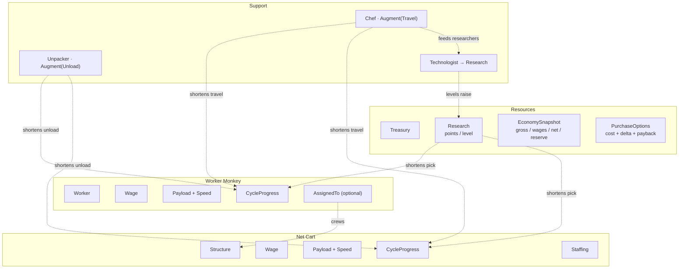

# Banana Incremental — MVP Architecture (v2)

**Engine:** Bevy (Rust), ECS-first.
**Scope:** Establish the simulation core. No prestige.

Supersedes v1. The economy is no longer a flat rate per unit; it is a harvest
cycle with separately attackable segments. Every change below is traceable to a
measured result in the companion white paper.

*Header note, added after the fact.* This document was written against a
headless, text-only renderer, and said so. The shipped game grew a sprite-based
Bevy front end and versioned local-storage save/load before this line was
updated — both are described in detail by D16, D22 and D23 below, and by §8's
feature cut, so the drift was in this header, not in the decisions. It is
corrected here rather than left to contradict the rest of its own document.

---

## 1. Core Loop

Monkeys walk to a grove, pick bananas, walk back, and unload them. That round
trip is the whole game.

Bananas pay wages and buy more monkeys. Some monkeys harvest. Others make the
harvesters better at exactly one part of the trip — Chefs feed them so they walk
faster, Unpackers clear the depot so they unload faster, Technologists research
better picking technique and unlock the Net Cart.

Because each support role shortens one segment of the cycle and no other, no
support role stays the best purchase for long. The player's job is to find the
current bottleneck and pay to remove it, then find the next one.

---

## 2. Invariants

| # | Invariant |
|---|---|
| ~~I1~~ | ~~Net banana rate is strictly positive after every legal purchase.~~ **Deleted, support increment.** |
| ~~I2~~ | ~~No harvester is *offered* unless its projected net delta is positive.~~ **Deleted, support increment.** |
| I3′ | Production **rate** is derived from world state every tick and never cached. Harvest **progress** is per-entity state, stored as remaining work. The treasury is credited on delivery. |
| I4 | The player can always see gross rate, wage rate, and net rate simultaneously. |
| I5′ | A purchase requires the *unencumbered* treasury to cover its cost: the balance less every meal a harvester has already reserved against a delivery it has made. There is no wage reserve. |

I3′ is the load-bearing one, and it is weaker than v1's I3 by necessity. A
monkey halfway to the grove is *somewhere*, and that position is not derivable
from component counts. What survives is the part that mattered: the rate is
still a pure function of counts and multipliers, so nothing can silently drift
out of sync with the world.

I5 was once a *wage reserve*, because cart income is lumpy while wages were
continuous. D18 removed the reserve for workers by removing the mismatch, and
D19 removes it for everyone by making every monkey post-paid. What is left of I5
is the encumbrance in D20: the price on the button is the price, but a banana a
monkey has already earned is not yours to spend.

**I1 and I2 are both gone.** I2 hid a unit whose price the player could
otherwise have been saving toward, which is a worse failure than showing a bad
buy — and with D11's payback numbers replaced by a live marginal rate (D21)
there is no ranked list left for it to protect. I1 died of ill-definition: once
an unfed monkey stops contributing to its multiplier (D19), `net` at the
whitepaper's end state is −1.44/s with everyone fed and +0.59/s with the
technologists idle, so the gate's answer depended on a multiplier state it never
named. Its stated purpose — "a purchase that drives net to zero strands the run"
— no longer holds either: an unaffordable monkey goes idle and stops eating, so
the economy recovers by itself.

---

## 3. Decision Log

**D1 — Bananas are a resource, not entities.**
`f64` in a `Treasury` resource. Counts stay far below $2^{53}$ in the MVP, but
the type should not need revisiting when prestige arrives.

**D2 — Wages are a per-unit component, not a global formula.**
Tiers tune independently without touching systems.

**D3 — Five unit types.**
Worker Monkey (harvests on foot), Cart (harvests with a crew of three),
Chef (speed), Unpacker (unload rate), Technologist (research).

*Renamed:* "Net Cart" is just the Cart. There is no second vehicle to
distinguish it from, and the shop has a column width to respect.

**D4 — All multipliers are additive within their term.**
`M = 1 + count × bonus`. Multiplicative stacking is unbalanceable at this stage.
Revisit post-MVP.

**D5 — Augments target a cycle segment, not an entity.**
Support units declare which *term* of the harvest cycle they shorten. No entity
relationships, no dangling references, and a new vehicle tier inherits correct
support sensitivity without a design decision.

**D6 — *Deleted.***
v1 exempted carts from the chef bonus to manufacture a tradeoff. Measured, that
rule removes Chefs from the game entirely: zero purchased across a full run,
because carts absorb workers into crews and leave no pool for chefs to improve.
One speed multiplier now applies to every travel segment, carts included. The
tradeoff survives on its own — see §5.

**D7 — Worker assignment is modelled by presence of a component.**
An unassigned worker has no `AssignedTo`. The pool is the query
`With<Worker>, Without<AssignedTo>`.

**D8 — *Deleted* (support increment).**
Carts are now crewed by exactly three monkeys or they do not run: a cart may only
be bought when three spare workers exist, and if they do not, its price includes
buying them. Partial staffing, the sampled crew fraction, and `delivery_scale`
all go with it. What the rule bought — a retired vehicle not becoming a permanent
tax — is bought more simply by there being no such thing as a half-crewed cart.
The original text follows.

~~Structures may be under-staffed and produce proportionally, and their
wages scale the same way.~~
A 1-of-3 crewed cart produces at ⅓ *and costs ⅓ of its wage*. Production-only
scaling makes a retired vehicle a permanent tax, which matters more once
vehicles are a ladder. Every cart performs the nominal full-cart segment work;
its crew fraction is sampled when a cycle starts and scales only the delivered
payload. Assignment changes therefore affect its next cycle. This keeps every
segment duration unchanged and makes production exactly proportional.

**D9 — No intermediate aggregation resource.**
Multipliers are locals inside the production system. Reintroduce when a second
augment targets the same term and the map stops being trivial.

**D10 — `AssignedTo` is the only record of staffing.**
`Staffing` carries `required` only. Assigned counts are tallied by query.

**D11 — Offers project rates, and only for harvesters.**
Each harvester's offer carries cost, projected net delta, and payback seconds.
Technologists are excluded — see D14.

**D12 — Production is `payload / cycle_time`.**
```
T = travel/M_speed + pick/M_tech + unload/M_unpack
```
Three addends, three support roles, one each. This is the whole design.

**D13 — Cycle progress is stored as remaining work, not elapsed time.**
Metres left to walk, nominal bananas of work left to pick or unload, and the
cycle's delivery scale; each tick consumes remaining work at the current
multiplier's rate. The nominal work equals literal payload at full staffing. At
partial staffing D8 scales settlement, not segment work. Buying a Chef then
correctly speeds up the rest of every trip already in flight without teleporting
anyone down the road, and buying an Unpacker helps carts already queued at the
depot. It also collapses three segments into one uniform representation.
The UI labels gross and net as steady-state averages and shows each cart's
in-flight payload, so a staffing change cannot make the next delivery look
incorrect.

*Implementation note (Worker Monkey, 2026-08-18).* A tick must be spent as a
**time budget**, not as `remaining -= rate × dt` followed by `remaining <= 0`.
The naive form fails twice, and both failures are silent:

- `1/20` is not exactly representable in binary, so repeated subtraction leaves
  a *positive* residual — 9.4e-15 on a 5-banana pick segment, 1.0e-15 on
  unload. Each residual costs a whole extra tick, stretching the worker cycle
  past its nominal 50.0 seconds.
- Discarding the budget left over at a segment boundary loses `dt/2` per
  boundary, a 0.21% throughput error at these parameters. Because the loss is
  absolute, it grows as a *fraction* when multipliers shorten the cycle: 0.28%
  with ten Chefs, 0.43% at `M_speed = 2.5`. Buying support would quietly make
  the implementation less accurate.

So: consume `needed = remaining / rate` out of a per-tick budget, carry the
remainder across the boundary, and compare with a tolerance of a billionth of
the segment's duration. A bounded iteration guard is load-bearing rather than
defensive — a zero rate makes `needed` infinite and the loop never terminates.

**D14 — Technologists are never ranked against harvesters.**
Their banana delta is exactly $-\text{wage}$ at every possible world state — it
carries no information. Ranking them requires net-present-value reasoning over
an invented horizon. The research track gets its own readout in the full
product; in the MVP the Technologist simply appears in the shop with a research
figure and no payback number.

**D15 — *Deleted* (support increment).** See D19: nothing drains continuously
any more, so there is nothing left to reserve against. The original text follows,
because the *reasoning* about lumpy income is still the reason D20 exists.

~~Purchases are gated on a wage reserve.~~
```
reserve = 2 × max(0, wages − pool_income) × cart_cycle / cart_count
```
Only the wages that carts are covering are at risk, and only for one delivery
gap. Costs 0.3 minutes across a 24-minute session.

*Superseded for harvesters by D18 (2026-08-18); the amendment below still
governs every continuously-drained unit, which is today the support staff and
the cart crews.*

*Amended (Worker Monkey, 2026-08-18) — the formula returns zero for a cart-free
economy, and that is wrong.* It hard-codes "the lumpy source is carts, the
continuous one is the pool", so with `K = 0` it reserves nothing. But a lone
worker delivers once every 47.5 seconds, which is not continuous by any
reading, and the treasury goes underwater without a reserve.

The fix is to identify the lumpiest source by *measurement* rather than by
name: reserve against the largest gap between deliveries, and credit only the
income that keeps arriving inside it.

```
gap     = maxᵢ (Tᵢ / nᵢ)                 over every source in the field
covered = Σ { rateᵢ : Tᵢ / nᵢ < gap }
reserve = 2 × max(0, wages − covered) × gap
```

This reduces to the published cart form whenever carts are the lumpiest source,
and to a constant **2.85 bananas** for a worker-only economy — `2 × 0.03W ×
47.5/W`, independent of `W`. Measured over 30 purchases and 40 seeds: median
worst dip −3.36 → −1.09, minimum −6.54 → −3.04, for 1.8% of pacing. The first
hire therefore needs 6.85 bananas rather than 4. All 39 contract assertions
still pass.

One near miss is worth recording, because it looks correct and is not. Using a
*blended* mean gap, `1 / Σ(nᵢ/Tᵢ)`, also collapses to 2.85 for workers — but it
under-reserves badly once carts exist (38.5 against a measured −66.0 dip at
`K = 4`), because frequent five-banana pool deliveries drag the average gap down
without doing anything to cover wages across the two-hundred-banana cart gap.
Averaging delivery *frequency* is the wrong statistic when income is both lumpy
and heterogeneous.

The alternative considered and rejected was clamping the treasury at zero.
Unpayable wages then become *free bananas*: a 12.5% pacing gift concentrated in
the first twelve purchases, and an exploit with no on-screen tell, since
spending down to exactly zero buys a wage holiday until the next delivery. At
`W ≈ 7` the forgiven amount exceeds the price of the monkey that caused it. Debt
is allowed to happen instead; it is rare and small, exactly as §6 intends.

**D16 — *Mostly deleted* (support increment).** The jitter existed to protect the
D15 reserve, and D15 is gone; measured against remaining-work progress the −38 →
−255 dip is 0.000 either way. Boarding staggers carts naturally, since three
workers finish their trips at different times. What survives is the *save-restore*
phase for workers, which is presentation, and the deterministic index-derived
stagger on support shifts — which is `worker::Lane`'s trick, not randomness. The
original text follows.

~~Cart cycle phase is randomised after assignment on spawn.~~
Carts bought in one burst otherwise synchronise. Measured, that deepens the
treasury dip from −38 to −255 in the same economy. One line; prevents a
punishment the player cannot see or diagnose. A new cart remains pending until
assignment completes, then samples its crew fraction and initial phase together.

Workers remain phase zero when newly hired so the purchase has a clear visible
consequence. On save restore, however, the existing workforce is assigned a
random elapsed-time phase across the cycle. This avoids a resume screen full of
monkeys reset to the stall without changing the economy: phase construction is
pure presentation state, and return-leg phases already imply a carried banana.
The geometric cost ladder still staggers hires on its own.

Carts keep their jitter: their wages are still drained continuously, so D15
still binds and the −38 → −255 measurement still stands.

*One cost this decision did not anticipate.* Withdrawing jitter was argued
purely against the treasury dip, which post-paid meals had already flattened to
0.000. But D18 introduced a *second* phase-sensitive channel: a worker stalls
only if a purchase lands inside its 2.5-second snack window. With jitter that is
an independent 5% risk per worker; without it, workers hired close together
snack in lockstep, so one ill-timed purchase can stall a whole cohort at once. A
single delivery funds 3.3 meals, so a cohort unblocks within a cycle and the
severity is low — but jitter is no longer *purposeless* for workers, and if the
stall ever becomes a harsher mechanic this is the first decision to revisit.

*And one presentational cost that was live.* Identical phases mean identical
positions: workers sharing a depth lane drew exactly on top of each other, so
four hires showed three monkeys. Jitter used to hide it. `worker::Lane` now
carries the hire index and derives a small deterministic along-route offset from
it — a presentation fix, deliberately not an economic one.

**D18 — Harvesters are paid out of the delivery they have just made.**
*(Worker Monkey, 2026-08-18. Supersedes D15 for workers.)*

A worker's cycle gains a fourth addend: a **snack**, taken at the stall
immediately after unloading, costing a fixed share `f = 5%` of the trip.

```
T       = (travel/M_speed + pick/M_tech + unload/M_unpack) / (1 − f)
meal    = w_salary × T           = 1.5 bananas of the 5 just delivered
```

The reserve existed to hedge a timing mismatch — wages fall due continuously,
income arrives in lumps — and for workers the mismatch was total: a fresh hire
spent a whole cycle costing bananas before earning any. Removing the mismatch
beats reserving against it on every axis:

- **Solvency becomes structural.** The credit strictly precedes the debit within
  a cycle and strictly exceeds it, so the treasury cannot fall below where it
  stood before the delivery. Measured worst dip over 20 minutes: **0.000** at
  `W` = 1, 4, 10 and 25, against −1.42 drained. I5 therefore reduces to
  `bananas ≥ cost` for workers.
- **The price stops lying.** The shop quoted 4.0 and enforced 6.85. That is the
  single piece of player-reported confusion this change came from.
- **The counter reads as arithmetic**: +5, then −1.5 two seconds later, flat in
  between — instead of an imperceptible 47-second drain punctuated by a jump.
- **Nothing downstream moves.** Both the meal and the eating time are defined
  against the cycle, so `w_salary` stays exactly 0.03/s at every multiplier.

**The share is load-bearing; a fixed 2.5 s is not the same decision.** Fixed, the
snack becomes an ever-larger slice of a shortened cycle: chefs would raise the
cost of labour per second and partly cancel themselves, and worker throughput
would converge to `q / t_snack` rather than to the §3 pick-rate ceiling that
bounds the entire game. Held as a share it costs a flat 5% of that ceiling, and
the ceiling theorem survives as `(1 − f) × M_tech / t_pick`. The contract suite
caught this: `CEIL worker throughput converges` failed against a fixed snack.

**A meal is deferred, never forgiven.** A worker that cannot afford its meal
stalls at the stall and resumes when food arrives; the debt survives. Clamping
the treasury at zero instead would turn unpayable wages into free bananas — a
12.5% pacing gift and an exploit with no on-screen tell, since spending to
exactly zero would buy a wage holiday. Stalling is a penalty, and it is the only
place in the economy where overspending has a visible consequence: the sprite
greys out and production stops.

Implementation-wise the settlement loop threads a **larder** — the treasury at
the top of the tick, plus everything delivered so far during it — through every
worker in turn. A worker eats only what the larder holds. That single value is
what makes the treasury non-negative by construction rather than by gate.

**~~Owed by the cart increment.~~ Paid.** Cart crews used to drain continuously,
so D15 and D16 bound them, and workers converged 5% under the §3 ceiling while
carts converged on it. D19 and D23 give the cart the same snack out of its own
delivery, so both methods now converge to the same per-monkey figure and the
reserve is gone for everyone.

**D17 — *Deleted* (support increment).**
Auto-pull existed to answer "which monkeys crew the cart?" every tick. With crew
fixed at three and bought with the cart, the question is asked once, at purchase,
and answered by boarding: the cart spawns as an empty box at the deposit and
takes the next worker to finish its snack, first come, until it is full. The
original text follows.

~~Assignment is auto-pull.~~
Cart slots beat the pool by 230–280% at every reachable world state, so the
optimal policy is always "fill every slot, overflow to the pool." Manual
assignment can only reproduce that with extra clicks or produce a worse result.
D7 and D10's representation stays; the player-facing choice is removed.

**D19 — Every monkey is post-paid, and an unpaid one goes idle.**
*(Support increment.)*

D18 gave harvesters a snack taken out of their own delivery. Support staff have
no delivery, so they get the same deal against a bare **10-second shift**:
`meal = wage × 10`, which is 1.0 for a Chef or Unpacker and 2.0 for a
Technologist. A bare period rather than anything derived from the harvest cycle,
because `meal / period` is then `wage` exactly with no multiplier in either
factor — the property D18 needed a *fraction* to obtain for workers comes free
here, since a shortened harvest cycle does not shorten a chef's shift.

Ten seconds rather than a worker-length fifty. Nothing funds this meal at the
moment it falls due, so the period sets the size of the lump landing on the
larder; at 10 s a chef recovers from an empty larder in under two seconds at a
modest pool, where 50 s would make the meal five times bigger and the recovery
five times longer. Starvation *frequency* is set by how hard the player is
spending. The period only sets how much it hurts.

**An unfed monkey drops out of its multiplier sum**, greys, and retries every
tick — `M = 1 + Σ *fed* units × bonus`. This is the same stall D18 gave a hungry
worker, moved to the units that can actually reach it. It does not run away:
a worker's meal can never exceed 1.5 of a 5-banana payload, so every pool worker
contributes at least 0.07/s at the worst possible multiplier state while support
drain falls to zero. Swept across ~300k reachable states, there is no
configuration where net is positive with everyone fed and negative with one chef
idle, so there is no bistable trap. What does happen is a partial equilibrium —
at over-supported states the Technologist is idle 40–72% of the time, the rate
stays positive, and the run stays alive.

**Feeding order is Unpacker → Chef → Technologist**, and deliberately not
declaration order. Under scarcity a fixed type order spends the last banana on
the least valuable monkey: an Unpacker's marginal contribution is 3.6× a Chef's
at the end state and 5.9× at twelve minutes, because by then the cart's unload
segment dominates. Research is worth nothing to anything currently in flight, so
it eats last. Fixed rather than recomputed from marginal value, because a fixed
order is deterministic and cheap and starvation is meant to be the rare edge of
the economy rather than a state worth optimising inside.

**D20 — A harvester's meal is reserved out of the delivery that funds it.**
*(Support increment.)*

D18's solvency argument was "the credit strictly precedes the debit within a
cycle and strictly exceeds it". That holds only if nothing else can spend the
credit in between — and D19's support staff, who draw on the same larder and
deliver nothing into it, can. The gap is small (2.5 s of a worker's 50 s trip)
and it is real: measured, workers stalled **8.4%** of the time after a
spend-to-zero shock at the whitepaper's end-state support bill.

So `HarvestCycle` carries an `earmarked` field. At Unload the whole payload is
delivered and credited — the counter still reads the arithmetic D18 wanted, +5
then −1.5 — but only `payload − meal` enters the larder. The snack is then eaten
out of the reservation and never touches the shared pool.

Two claimants have to respect it for this to mean anything. Support staff do,
through the larder. **The shop does too**, through `spendable = treasury −
committed`: the quoted *price* does not move, since quoting a higher price is
exactly the lie D18 was written to remove, but an encumbered balance cannot
cover it.

This is what makes the cart possible at all. A cart's meal is **37.9 bananas**
against a 200-banana payload, and a cart that missed one would freeze holding
that payload. At an empty pool — legal, since D8's deletion lets you spend your
last three spare workers on the crew — the cart is the only harvester, so income
would be identically zero and the treasury could never climb back to free it. An
absorbing soft-lock whose only exit is 37 manual clicks with nothing on screen to
explain it.

*One designed mechanic dies here, and it is worth being explicit about it.*
A worker can no longer go hungry: its food is reserved from its own delivery, and
neither the player's spending nor the wage bill can reach it. D18 called stalling
"the only place in the economy where overspending has a visible consequence".
That consequence now lands on the support staff instead — which is a better
teaching signal, because it points at the actual mistake: you hired staff you
cannot feed. The grey pulse, the HUNGRY readout and the idle sprite all moved
from `worker` to `support` rather than being deleted.

**D21 — The shop shows a live marginal rate, not a static effect.**
*(Support increment.)*

D11 projected rates for harvesters only, on the grounds that a support unit's own
banana delta is exactly `−wage` and carries no information. True, and beside the
point: what a Chef is worth is not what it produces but what it makes everybody
*else* produce. The shop's GAIN column is that number, recomputed every tick.

The alternative was a static effect string — "TRAVEL +15%" — which is honest
about the mechanism and useless for the comparison the table exists to support:
three different units down one column, and a figure that means +12.6% throughput
in a worker-heavy world and about +1% in a cart-heavy one. That is precisely the
Amdahl rotation §5 calls the whole design, hidden behind a constant. A live rate
shows a Chef at +4.2/min early and falling below its own wage once carts drain
the pool, which is the bottleneck moving, rendered.

The Technologist keeps `+1.0 RESEARCH/s` and a different colour. Being visibly
the one row the ranking does not price is correct (D14); it should look
intentional.

**D24 — The grove distance is measured on a map, and the units were rescaled to
pay for it.** *(Map increment.)*

`GROVE_DISTANCE` was 100 m because somebody chose 100. The village now has a
map — `assets/maps/start.txt`, a grid of jungle, ring path and town parsed by
`map.rs` — and travel is the walk across it: A* on the passable tiles, pulled
taut so that what the economy is charged for is the line a monkey actually
covers rather than the staircase a grid search returns. The shipped walk from
the town centre to the nearer banana node is 30 tiles of 2 m, and
`GROVE_DISTANCE` is now that measurement. A test asserts the equality, so
redrawing the map fails the build rather than silently moving the balance.

Sixty metres is not a hundred, so the distance and **both** speeds were divided
by 5/3: worker 5→3 m/s, cart 15→9 m/s. That is a change of units and nothing
else. Every duration in the whitepaper is a ratio `d/v`, `M_speed` is
dimensionless, and so the 40 s worker leg, the 13.3 s cart leg, the Chef effect
and D17's cart advantage all come through untouched — `docs/test_banana.py`
passes against the rescaled oracle without a single expectation being edited,
which is the evidence for the claim.

The cart is the trap here and is why the rescale had to be total. It shares
`GROVE_DISTANCE` with the worker while owning a separate speed, so changing the
distance and only the worker's speed would have quietly moved a cart's travel
leg off 13.3 s and taken D17's measured 230–280% advantage with it. §8's warning
about these levers stands; this is the one move on them that costs nothing.

The invariance is exact in real arithmetic but not bit-exact in `f64`: `5·1.15`
and `3·1.15` round differently, so any state with `M_speed ≠ 1` differs in the
last few bits. Measured across 32 256 oracle states the worst relative deviation
is 4.8e-13, and a simulated hour produces an identical 97-purchase sequence at
both unit systems. Nobody should read "a change of units" as a bit-identity
guarantee, and nothing in the game is anywhere near that tolerance.

For the MVP the map holds two banana nodes and the workforce works the nearer,
so every worker walks one length and `CycleSpec::distance` stays a constant.
The constant becomes a lie the moment a second node goes live and workers can be
assigned, and that is the point at which `distance` moves from `CycleSpec`'s
consts onto the entity. Two things become live debts at that same moment, and
they are the same debt twice: `Route::length` is the length of a *greedily*
straightened polyline, not the quantity A* minimised, so on an obstructed map a
one-tile edit can move it by a double-digit percentage through tie-breaking
alone. Today that cannot reach the economy — the constant is compile-time, the
only caller of `route` is `--map`, and the worked walk is a single clear segment
whose length equals its own straight line and is therefore minimal outright. It
reaches the economy the day routes become an input, and the answer then is an
any-angle search (Theta*), which optimises the length it reports.

*Where the map is going, and the one rule the swarm must not break.* Monkeys
will walk the polyline rather than a straight lerp, and each will carry a small
stable offset so a crowd reads as a swarm instead of a single file. Offsets are
presentation: every monkey advances by the shared dimensionless
`segment_fraction`, so a wider lane shows up as a slightly higher *apparent
speed* and never as a different cycle time. The forbidden construction is the
other one — giving each monkey its own length and letting arrival be driven by
the drawn position — because that is precisely the failure `map.rs` exists to
prevent: a drawn path and a cycle time that are two different journeys. Lateral
spread is quadratically cheap, so this costs nothing to honour: a ±2 m lane on a
60 m leg is 0.03 m, 0.06%.

*Sizing, which is a design decision and not an arbitrary one.* The town is 39
tiles square, not the 55 it was first drawn at. A 55-tile town holds ~84
building plots against a roster of five unit types and a measured session of ~53
purchases, and the surplus is the worst kind of empty: on a phone the player
*pans*, and screens of blank town floor read as an unfinished level, where
screens of jungle read as somewhere still to go. The reclaimed tiles went to the
jungle band, which is now 13 thick with at least 8 tiles standing between every
node and the edge of the world. Grove clearings are 7×5 rather than 3×3 because
`late-game` puts 18 walkers and 4 carts on one route, and a 3×3 clearing stacks
them on a single tile — the map is what gives the renderer permission to fan a
crowd out.

*The home tree.* Manual harvest is a drag from a banana node to the town centre,
and the worked node is 30 tiles away while a phone at a legible zoom holds well
under twenty. The two ends are never on screen together, so the gesture the
whitepaper says players will spam for the first dozen purchases would be a
multi-second drag against an auto-panning camera. A third node — `T` in the map,
five tiles from the town centre, hand-picked only and never assigned a worker —
makes it a one-thumb flick, and fills the opening forty seconds, which are
otherwise one monkey walking off-screen and nothing else. It is deliberately
*not* in `Map::groves`: being nearer than the worked node, it would otherwise
take over as `worked_grove` and move the travel leg without anybody noticing.

**D25 — One projection, and depth is decided by feet.**
*(Map increment.)*

The board used to be a unit square holding an invented route, scaled to fit the
window. It is now a view of the map: `isometric::project` takes a position in
metres on the ground plane and returns a point on a 2:1 isometric plane, and
every actor, tree, hut and tile goes through it. `SceneLayout` stopped being the
world and became a camera — two numbers, an origin and a zoom — so the drawn
village and the walked economy are the same place by construction rather than by
two sets of coordinates agreeing.

The layering rule is one function. `stand_z(ground, nudge)` sorts a thing by the
tile its **feet** are on, never by where its artwork reaches. That is what makes
the hut cover the monkey behind it while the monkey in front walks past
unobscured, and because depth is continuous rather than per-tile, crossing a
building's front edge changes the order smoothly instead of popping. The `nudge`
that separates two monkeys idling on one spot is *clamped*: an unbounded
per-entity epsilon is precisely how a crowd starts flickering once there are
enough of them for the epsilons to add up to more than the gaps between them.

What is drawn follows from that rule rather than from convenience. The ground
plane is flat, cannot occlude anything and never changes, so it is one baked
mesh with per-vertex colour — one draw call for 4761 tiles, where an entity per
tile would be 4761 sprites to cull and sort every frame. Anything with *height*
is its own entity anchored to its ground position, because that is the only way
it can interleave with a moving monkey. Seen from above the jungle is its
canopy, so its depths stay flat and only the tiles touching walkable ground are
raised into a wall — the edge is the part that has to look like a barrier.

The rule has a second half, and it is the half that bites. Because z is now a
tile's *depth* rather than a hand-picked layer, the board occupies z 0..137 and
grows with the map — so the old habit of "a small z means on top" is exactly
backwards. A baked mesh is opaque and *writes* depth while a sprite tests
against it without writing, so a dragged banana left at z = 4 is not merely
mis-sorted: it is behind the hut, the palm and every wall tile, and disappears
at the one moment the player is holding it. Anything belonging to the player's
hand rather than to the ground — a dragged banana, a delivery floater, a role
badge, a label — goes above the whole world at `OVERLAY_Z`, and a test asserts
the board can never reach it.

The nudge that separates two things on one spot is bounded below by the *depth
buffer* rather than by `f32`. The camera spans z -1000..1000 into a 32-bit
target, so one buffer step near the village is about 1.2e-4 in world z; a finer
nudge is invisible to any comparison against an opaque mesh however well `f32`
resolves it. And the clamp is a backstop, not the mechanism: two callers that
both exceed it do not get an order, they get the same z, so an out-of-range
nudge is a caller's bug and says so in a debug build.

The stall stands *beside* the delivery point, never on it. The town centre tile
is where a worker unloads and the queue spreads a few metres around it, so a
four-metre hut centred there swallows half the arriving crowd at exactly the
moment the player is watching — the counter ticks, the floater fires, and the
monkey that earned it is inside a building. It steps aside square to the walk,
so nobody routes through it, and to whichever side is further from the viewer,
so the queue forms in front.

One known limit, stated so it is not rediscovered: a multi-tile footprint can
carry only one depth. The hut takes its centre's, which is half a footprint of
error either way rather than a whole one at a corner. Keeping footprints small
is what keeps that invisible, and it is the reason to be wary of large buildings
later.

The board is aimed at the midpoint of the walk rather than at the town centre.
That is an interim: pointed at the town centre, the grove sat off the top of the
screen and took the whole outbound leg with it, and a fixed board has to hold
both ends of the economy for a playtest to mean anything. A camera the player
can pan and zoom replaces it, and is what the mobile brief actually asks for.
**Superseded by D26.**

**D26 — Where the player is looking belongs to the player.**
*(Camera increment.)*

`SceneLayout` recomputed its aim from the window every frame and pointed the
board at the midpoint of the walk. Pan and zoom are now a `BoardCamera`
resource — a focus in **metres** and a zoom — and the layout derives its origin
and scale from it. The window still decides the HUD's reserve: the banner's
strip, the store's panel, and the square the two of them leave. It no longer
decides where the board is pointed.

The focus is kept in metres rather than as a screen origin, and that is what
makes it survive a zoom, a rotation and a resize without drifting: the player is
looking at a *place*, not at a pixel.

*Both gestures are one operation.* `hold(world, screen)` re-aims the camera so a
given metre sits under a given point. A drag holds the metre the finger landed
on; a pinch holds the metre between two fingers while the scale changes under
it. Neither is expressed as "move the camera by an amount", which is how a pinch
ends up sliding the ground out from between the fingers pinching it.

*Harvest gets right of first refusal on a pointer; the camera takes what is
left.* A manual harvest is a drag that starts on a banana node and a pan is a
drag that starts anywhere else, so the only way to tell them apart is the order
the two systems run in. Eligibility is decided once, at touch-down, and never
revisited — a finger that starts on the store and slides onto the grass is still
scrolling the store. A pinch needs *two* unclaimed touches, so a second finger
cannot tear a banana out of the player's hand. Adding the drag-and-drop harvest
of a later increment adds a place harvest claims, and the camera gives it up
without knowing the node exists.

*Zoom is continuous during a pinch and settles onto a whole step on release.*
The ground is a vertex-coloured mesh and takes any scale; it is the sprites that
crawl off the texel grid, and a gesture is the one moment the player is looking
at their own fingers rather than at a monkey's texels. Rest is when the grid
shows, so rest is where it is enforced.

*Texel snapping is measured from the board, not from the window.* `snap` used to
round an absolute screen position, and `origin` is not a multiple of `zoom` — a
fixed sub-pixel bias nobody could see on a fixed board, and a per-frame one that
makes the whole cast jump in zoom-sized steps against smoothly sliding terrain
the moment the player can pan. `board_snapped` quantises the offset from the
origin instead, and the origin itself is rounded to whole pixels.

*The pan clamp is measured from the walk, and it bounds what is on screen
rather than where the focus is.* The field is the **polyline** through the home
tree, the town centre and the *worked* grove, with a margin; the slack allowed
off it shrinks as the player zooms in, capped at whatever keeps the nearest
point of the walk inside the short side of the safe area. The guarantee is
therefore "some of the ground your monkeys cover is always on screen" — and
deliberately not "the village is always on screen", because looking at the
middle of the route with neither end in frame is a thing a player should be able
to do.

The two obvious cheaper versions both fail, and both failed here first. A
map-sized leash lets a player flick into forty metres of identical jungle with
no way of knowing which way is back. A *bounding box* around the same three
points is barely better: its corners are two hundred projected pixels from
anything, and clamping the bare focus into it let ten drags on a phone land on a
corner of canopy and a screenful of empty sky. The test that was supposed to
prevent that asserted the clamped focus was nearer a landmark than the
*diagonal of the box*, which is true by construction — a tautology that passed
throughout. The grove that is never worked is out of the field for the same
reason: folding in a node 117 m south stretched the leash half again as far for
ground nobody has ever been to. It joins the walk the day it is worked.

*The floor is how big a monkey is, not how much map fits.* A monkey is 22 texels,
so zoom 2 renders it 44 logical pixels. Fitting the whole 69×69 board on a phone
would need about zoom 0.3 and a six-pixel monkey: the entire map visible and
nothing on it worth looking at.

Two limits are stated here rather than left to be rediscovered. **The board opens
at its floor**, so pinching outwards on a fresh board does nothing. It sits there
because the opening hand-harvest drag (D24) and the three support stations must
all be inside the safe area, and on an 844×390 landscape phone — the tightest
safe area the game supports, 286 px square — that fails at any zoom above 2. And
**the village is wider than a phone at that zoom**: the projected span from the
home tree to the stall exceeds the safe area at *any* focus, so the opening frame
guarantees the interaction — home tree, town centre, support stations — and lets
the hut sit just off the right edge, one short drag away. The alternative was
pulling the stall back towards the delivery point it was deliberately moved off
(D25), trading a known-good property for a framing nicety.

The support stations moved from a line out from the delivery point (five, eleven
and five metres) onto an 8.2 m ring at bearings chosen for *projected*
separation, which the isometric fold makes a different question from ground
separation. The line separated its members on screen only because the far one
was twice as far out as the near one, and the eleven-metre station left the
screen entirely at the camera's opening zoom — a chef the player had paid for,
drawing wages somewhere they could not see.

*The delivery point is drawn.* It was not, and that is the flaw the camera made
impossible to keep ignoring. The town centre is where every delivery lands and
where the opening hand-harvest drag ends, and it rendered as the same green as
the forty tiles around it: a new player was shown a lawn with the word VILLAGE
floating over it and asked to drag a banana onto the label. The one prop that
could have named the spot — the stall — stands eight metres aside so it does not
swallow the arriving queue (D25), which is off the side of a phone at the
opening zoom. A depot is now trodden into the **ground mesh** at the town
centre: nine tiles of bare earth with a scuffed ring around them. Painting it
into the terrain rather than building a prop is what makes it free — no draw
call, no sorting, and above all no *span*, because it sits exactly where the
board is already aimed and so cannot push anything else off the screen. The
label reads DEPOT, names the drop target rather than the terrain, and sits a
monkey's height above the pad instead of six metres over empty sky.

*Floaters carry their own edge.* Every floater colour failed contrast against
the ground it lands on: town floor is #A3C975 at luminance 0.508 and GOLD is
0.586, which is 1.14:1 — under the 3:1 floor for large text before the alpha
fade even begins. The palette was chosen against the cream HUD, not against
grass. Four INK copies behind each glyph take it to 8.4:1 and fix all four
floater colours at once, without repainting a palette that is right everywhere
else. This matters more than it sounds: the floater is the game's primary
reward feedback.

**D27 — A crowd is per-monkey, and none of it reaches the economy.**
*(Swarm increment.)*

Three rows and five stagger steps is fifteen distinct positions, so every
fifteenth hire was drawn pixel-identical to the first — and at thirty workers
the repeat is the thing the eye locks onto. Worse, two monkeys on the same
segment fraction were a *rigid constellation*: the same distance apart for the
whole trip, every trip, never passing. That is what made a crowd read as a
formation. Every offset is now a continuous function of the hire index.

*The offsets are hashed from the hire index, never stored and never drawn from
an RNG.* The index is already persisted, so a monkey comes back from a reload
standing exactly where it stood, and the save format learns nothing. An RNG
would need five more numbers per worker to say the same thing.

*The fraction remap is a sine bulge, and the shape is the whole argument.*
`f' = f + a·sin(πf)` with `|a| ≤ 0.06` re-times where a monkey is **drawn**
along the walk without changing where the economy has it. The remap is the
identity at both ends, so a monkey is drawn leaving the depot and reaching the
grove at exactly the fractions the economy has it at, and only the middle moves.

That identity is a *floating-point* fact, not an algebraic one, and the first
version of this decision claimed otherwise. `sin(π)` in `f64` is 1.22e-16, not
zero; `f + a·sin(πf)` is exactly 1.0 at f = 1 only while `|a|·1.22e-16` stays
under half an ulp, which holds for `|a| < 0.907`. There is fifteen thousand
times that margin at the shipped 0.06, and the test asserts the equality rather
than trusting the algebra.

Two further bounds on `a`, neither of them the aesthetic one. **Monotonicity**
needs `|a| < 1/π ≈ 0.318`, since `d/df = 1 + aπ·cos(πf)`; past it a monkey
visibly walks backwards, and monotonicity plus fixed endpoints is also what
makes the range exactly [0,1], so no separate range argument is needed.
**Apparent speed** is what actually binds: the drawn speed is `v·(1 ± aπ)`, so
the shipped 0.06 already means leaving 19% fast and arriving 19% slow.

*What protects the economy is the plugin seam, not the shape of the remap.*
`swarm_fraction` is reachable only from `walk_point`, which only presentation
calls; the vanishing endpoints buy *visual* continuity at a segment boundary.
Two contracts hold the seam from different sides:
`the_swarm_never_reaches_the_economy` asserts a crowd of sixty delivers on the
same tick as a monkey walking alone — which catches a spread or scatter leak,
and cannot catch a wobble leak, because a wobble routed into the simulation
would still deliver on tick 950. `the_hire_index_is_invisible_to_the_economy` is
the one that sees that: it runs the same world from two different hire-index
bases and demands bit-identical deliveries and treasury.

Neither half of the offset produces overtaking on its own, which is why both
exist. Relative position is `Δb·sin(πf) + Δs`; `sin` is non-negative with zeros
at both ends, so a pair swaps **iff the two differences have opposite signs and
the varying one is larger** — closed form, not something to sample. Independent
uniform draws put that at 14.95% of pairs; the shipped crowd of sixty measures
18.8%.

Two limits of the bulge, recorded rather than fixed. The order at *both
endpoints* is `Δs` — a fixed function of the hire indices, identical on every
trip forever, so every overtake is transient and exactly undone by arrival.
And the passing is **end-loaded**: relative velocity is `∝ cos πf`, which is
zero at the midpoint, so three quarters of crossings happen before f = 0.25 and
the middle of the walk is the rigid read the increment set out to kill. An
index-hashed second harmonic `c·sin(2πf)` has its maximum rate at the midpoint
and would fix that, but it is bought with apparent speed, which is already the
binding budget.

*The swarm is drawn across the local corridor, not across a constant.* A fixed
lane width has to be narrow enough for the tightest point on the route, so it is
that narrow everywhere. `Map::corridor_half_width` casts a ray either way across
the walk and answers with the *smaller* clearance, so a crowd centred on the
route stays inside the gap rather than leaning into whichever wall is further
off. The clearance is measured **after** the along-route scatter, at the point
the monkey actually stands: measuring it before and then displacing by up to
seven metres asks the width of one place and spends it at another, which drew
four of sixty workers up to a metre and a half inside the jungle wall.

Two things worth stating plainly about what this is currently worth. The
corridor sits at its cap for **94.8% of the shipped walk** — the machinery is
inert almost everywhere, and the one squeeze (eight metres of crowd to five and
a half) lasts about a second out of a twenty-second leg. And the *slope* is
unbounded: the ray-cast made the width continuous, not gentle, so at the pinch
the outermost monkey crosses sideways at four metres a second while walking at
three. Both are investments in maps that do not exist yet. A map with a real
neck — mid-route, four or five metres wide, several seconds long — is what would
make the mechanism worth the reader's attention, and is also what would make the
slope worth bounding.

The traversal is a grid ray-cast rather than a sampled march, and the reason is
continuity rather than precision. Probing at fixed intervals answers in whole
steps, so the width jumps by a step as the ray creeps forward, and a swarm drawn
across that width snaps narrower and wider as it walks. It reads as the crowd
flinching, and it is what
`an_outer_offset_turns_a_corner_instead_of_teleporting_across_it` caught.

*Standing is a different shape from walking, and the two are blended rather than
switched between.* At an endpoint a monkey takes a bearing and a radius instead
of a corridor offset, so the group is a crowd around the thing it is queueing
at. The two shapes share no term, and switching between them on the segment
boundary cost a **six metre jump** — three tiles, ten at worst — four times per
cycle per monkey, at exactly the moment a delivery lands. The walking path is
held to a continuity bar and the handoff was allowed thirty times it. A monkey
now steps aside over the first third of the arriving segment, and the bar covers
the whole cycle: the worst jump is 0.10 m in a rendered frame, against 0.05 m
for ordinary walking.

The crowd is a **horseshoe, open away from the viewer**, not a full ring. A ring
is symmetric on the ground and asymmetric on screen, because every sprite grows
upward from its feet: the far arc's bodies pile over the middle while the near
arc's feet leave the near half bare, and the whole thing reads as a heap beside
the landmark rather than a crowd around it. Leaving the up-screen arc empty
keeps the pad and the trunk visible, and a crowd at a counter stands in front of
it anyway. The outer radius is sized to the depot's own trodden ground, so the
pad contains the crowd standing on it.

One scaling risk, recorded because it is not a constant tweak: the band's area
is fixed while the standing share of a cycle *rises* with Chefs, and the worker
cap is a thousand. Holding density constant needs the radius to grow with the
square root of the crowd, which means passing the standing count into the
placement.

The cart's bay is measured from the swarm's own edge rather than set at a fixed
distance, so it leads the crowd through the pinch instead of parking in the
hedge beside it: the ground the swarm has to squeeze through is the ground the
cart has to squeeze through.

**D28 — The art sets the scale, and the simulation never touches it.**
*(Art increment.)*

The cast and the scenery were placeholders: coloured rectangles with a two-texel
outline, a hut built from three shaded quads, a palm whose crown was a 0.7 m
slab. Every one of them is now drawn art — the spider worker's walk and idle
loops, the town centre treehouse, five jungle plants and the two banana states.

*One scale, taken from the worker.* The assets were all authored against the
same 64×64 worker reference, so they already agree with each other; the game
needs exactly one conversion from art pixels to world texels. `ART_SCALE` is
pinned by the monkey — its 55-pixel silhouette comes out 22 texels, the height
the placeholder rectangle was drawn at — so the board, the camera's zoom floor
and the support fan all keep the numbers they were tuned against, and every
tree, roof and leaf inherits its proportion to the monkey from the artist rather
than from a constant chosen here.

The one deviation is stated as one. The town centre is drawn at about ten
monkeys tall, which is a fine building and a poor *landmark*: at the shared
scale it is wider than a phone's entire safe area, and it covered the depot pad
it stands beside, the crowd unloading there and both ends of the opening drag.
It is drawn at 0.62.

*Sprites are anchored at their feet, and that is what let the art replace the
meshes without touching the layering.* Every manifest gives a ground anchor in
art pixels rather than a centre, and Bevy's `Anchor` takes a fraction out from
the centre with the y axis the other way up. A sprite anchored that way sorts
through `stand_z` exactly as a prism built from its footprint did (D25), so the
treehouse covers a monkey behind it and not one in front, with nothing new in
the sorting rule. Sizing a sprite to its opaque bounds instead is the tempting
shortcut and is exactly wrong: the two banana states differ only in whether the
bunch is on, and bounds-fitting would move the plant the moment it was picked.

*The simulation spawns the monkey; the presentation dresses it.* The spawn
systems used to build their own `Sprite`s, which worked only because a coloured
rectangle needs no resource to make — the first sprite that needed an asset
server broke every headless contract at once. `dress_actors` runs in
presentation and gives art to any actor that has none, so a thousand ticks of a
sixty-monkey economy still runs with no window.

*The playhead is per monkey, seeded from the hire index.* A shared animation
clock would have sixty monkeys plant the same foot on the same frame — the
formation read D27's offsets exist to break, reintroduced in the one channel
those offsets cannot reach. Only the two loops are played. The artist also
supplied `rise` and `settle` transitions, but they are one-shot clips needing
playback state and an interruption rule, and *moving* and *not moving* is the
whole of what the board has to say.

Two things are deliberately left as they were. The idle animations for the
jungle and the town centre move by a single native pixel, which at this scale is
four tenths of a texel and cannot render, so those use the static exports and
the game loads five small textures instead of two atlases of 2688×2816. And the
support roles are still told apart by a tinted primitive worn over the sprite —
a cap, a crate, a desk — because there is no prop art. Those primitives are now
placed from the art's measured silhouette rather than from the rectangle they
were authored against, which is why they read as carried rather than as floating
squares, but they remain the weakest thing on the board.

*Corrected on review.* This increment shipped unreviewed, and review found that
several of the sentences above were not true of the code, and that some of the
code was not true of the art. Recorded here rather than silently edited, because
each is the same mistake — a number read off the wrong thing:

- **The scale was pinned to an asset the game never loads.** "55 pixels" is the
  bounding box of `docs/references/spider-worker.png`, a standing study. The
  sheets played are a quadruped 58 pixels from tail tip to toe: 23.2 texels,
  46 logical pixels at the zoom floor. `ART_SCALE` stays 0.4 — everything was
  tuned within a texel of that — but its test now decodes the sheets and
  measures every frame, where it used to multiply two literals together.
- **The walk skated at two and a half times its stride.** The sheet's planted
  foot covers eight texels a loop; the loop was played against the clock in
  0.72 s while the monkey moved 27 texels a second, and faster with every Chef.
  The playhead is now advanced by distance *drawn*, one loop per eight texels,
  keeping the manifest's 70/60/50 proportions as shares of the stride. It is
  right at any speed, any Chef bonus and any swarm remap by construction.
- **Placements used the placeholder's numbers.** Riders sat at `22 × 0.30`, a
  centre offset for a rectangle, which stood all three on the cart's lid once
  they were anchored at their feet; the chef's cap covered the face down to the
  snout; the carried banana sat on the head and rode the tail when the sprite
  flipped, because `flip_x` mirrors the texture and not its children. Every one
  now goes through `Cell::offset_of` from a row measured off the sheet, and the
  tests hold the rows to the pixels.
- **The role tint was invisible.** 94–100% white multiplied over near-black
  fur. Roles are now said by a disc of the shop's own swatch colour under each
  support monkey — its contact shadow too — with the props recoloured to match
  the shop, where the unpacker's crate had been the *worker's* orange. Hunger
  drains the disc to grey, since dimming a black monkey showed nothing.
- **The fan was a queue.** Same-role monkeys stepped 13 texels along a ground
  diagonal that projects mostly *into* the screen, so two chefs drew as one
  monkey with two caps. A fan is something the player sees, so it is now laid
  out in screen texels and taken to the ground by `unproject`: one in front,
  two behind to either side. A line across the screen does not fit — the walk
  runs up the screen past the depot, and a line wide enough for three monkeys
  crosses it on one side and leaves a landscape phone on the other.
- **`Pose` was never read**, and `Playing` was spawned by the simulation. The
  playhead is presentation, so `dress_actors` inserts it on the loop the
  monkey's segment wants — a monkey restored mid-unload used to open on a walk
  frame — and the chain is dress, position, animate in one frame. "One frame
  later" above was also wrong: `FixedUpdate` spawns before `Update` dresses.
- **Nothing had a contact shadow but the scenery**, which bakes its own, so the
  cast looked more detached than the rectangles had. Walkers get a flat
  ellipse at 33% in the art's shadow green, on a shared ground-mark layer
  between the terrain and anything standing, so a shadow never covers the
  monkey behind its owner.
- **0.62 is not two thirds**, and two thirds would not fit. The treehouse's
  opaque art is 254 × 282 pixels at the zoom floor against a 286-pixel safe
  area, and a test now says so from the PNG.

**D29 — The drag starts and ends on the ground.**
*(Manual-harvest increment.)*

The hand-harvest drag predates the board it now lives on. Its targets were
squares of *screen*, `scene_side × 0.18` across, sized from the chrome: zoom in
and the plant grew while its target stayed put, zoom out and the target
swallowed the village. They were axis-aligned in an isometric world, and so was
the deposit glow — which on a phone was the most dominant object on the board
and the only thing on it off the 2:1 grid.

*The targets are footprints, and the pointer goes down to meet them.* A
`Footprint` is a square of ground, `half` metres either side of a centre along
both ground axes: a tile, grown. On screen it is a diamond on the grid. A drag
is tested by taking the pointer to the ground — `SceneLayout::ground`, which is
`unproject` under the camera — and asking whether that metre is on it. Bringing
the target up to the screen instead is the tempting version and it is only
approximate, because the fold turns a square into a diamond and a box round the
diamond grabs its corners' empty air.

The cheaper alternative was to keep screen rectangles and scale them with the
zoom rather than with `scene_side`. It fixes the size and nothing else: the
target is still a box off the grid, still a different shape from the ground it
marks, and still tested in a space where "on the depot" means "near its label".

The sizes are the ground's own. The harvest target is three metres either side
of the home tree at the zoom floor, where its diamond's short axis is 96 px — and
it never grows past that on screen. Harvest has first refusal on every press,
so its target is ground the camera cannot be driven from, and three metres at
every zoom was 576 × 288 px at zoom 6: three quarters of a landscape phone's
board, with nothing left to pan or pinch on but the corners. Zoomed in, the
plant grows and the ground its target covers shrinks, never below the banana's
own spot. A narrow column up the trunk into the lower crown grabs as well. The
palm is the biggest, brightest thing by the banana and what a stranger reaches
for, and a press on it used to be the camera's, so the player's first try slid
the board away from the thing they were reaching for. The drop
target is the depot's trodden and scuffed ground edge to edge
(`DEPOT_REACH_METRES`, five), so what the player sees as the depot is exactly
what takes the banana. The home tree is ten metres out along one ground axis,
so three and five leave two metres that are neither, and a drag cannot start
on its own drop target. A test walks both targets at every zoom from 2 to 6
and three pans, and asserts a point grabs exactly when the ground under it is
on the footprint, that it stays at least a thumb across at every zoom, and —
sampled over the whole board with the camera on the home tree — that harvest
never claims a quarter of it. The screen squares got the first wrong, and the
first version of this increment got the last.

The glow is the drop target's own diamond, a translucent mesh on the ground
under the crowd's shadows (`GLOW_Z`, below `MARK_Z`), placed by its transform so
it pans and zooms with the ground it marks.

*The banana is drawn, and it lies on the ground.* `assets/Banana/Banana.png`, a
twelve-frame spin that was loaded nowhere, replaces three coloured rectangles.
It is an icon rather than part of the shared-scale set, so it cannot inherit a
size from the monkey; it is drawn at one art pixel to one texel, the only whole
ratio that leaves it smaller than the monkey carrying it (D28), and at half that
on a monkey's back. It lies at the home tree's foot, a step towards the viewer
so it sorts in front of the plant, where it used to hang 1.4 m up — a height
chosen for the palm mesh's crown, which against the drawn plant tied a yellow
band round the trunk.

A held banana is drawn fourteen texels above the pointer and never less than 44
logical pixels, so it clears a thumb's pad and the DEPOT sign it is aimed at.
Its shadow stays on the ground under the pointer, on the metre the drop is
tested against. With a mouse the shadow is the aim; on a phone it is under the
thumb, the finger itself is the aim, and the banana riding above it is what says
it is being carried. One system places both, after input, so the shadow is never
a frame behind the banana.

*Until the first banana is carried home, both ends are marked.* A faint gold
diamond lies under the banana — exactly the target, at whatever size the zoom
has made it — and the depot glow breathes slowly. The board then says "from here
to there" without a word of text. Both go out for good at the first hand
delivery, and never show on a board with monkeys hired: a tutorial glow under
sixty workers is noise, and a player who has hired has learned the drag.

*The crowd walks a triangle across the corridor, not a flat strip.* `across` is
now the sum of two hashed dials less one — densest on the route's spine and
thinning linearly to nothing at the edge, where a uniform draw filled the
corridor at one density right up to ruled sides. Same range, so nothing that
keeps a monkey inside the corridor changed; mean |across| is 1/3 against a
uniform 1/2, and a test holds the crowd between the two models.

*Harvest stays reachable, or says it is not.* The pan clamp promises that some
of the walk is on screen (D26), not the home tree, so a player can pan to where
hand harvest is impossible. On a desktop `C` recentres; on a phone there was
nothing. The bar's empty left cell — there only to centre the banner — now
holds a HOME button, shown exactly when either end of the drag is outside the
safe area. Always shown, it is a permanent control for a problem most players
never have; never shown, the player who panned to the grove has no way back and
no sign the banana still exists. Appearing when the drag leaves the screen makes
it the feedback and the fix at once. It recentres the zoom as well as the aim,
exactly as `C` does, through the camera system that owns both.

*The gesture seam is unchanged, which is the evidence it was built right.*
Harvest still gets first refusal at touch-down (D26) and the camera still takes
what it declines; all that changed is what "on the banana" means. No simulation
state moved — a manual harvest is credited through the same `DeliveryQueue` on
the same tick — so there is no new economy contract, and the headless suite and
`docs/test_banana.py` pass untouched.

Known limits, stated so they are not rediscovered. A press on the plant's outer
fronds, beyond the trunk column, still pans: the column is kept narrow so that
zoomed in, where the crown fills the screen, the board is still the camera's. HOME returns to the opening
view rather than to "enough to see both ends", which from maximum zoom is a
jump of four steps. A drag does not pan the camera, so at high zoom on a
landscape phone the depot can be off screen with the banana in hand; releasing
there cancels, and HOME is visible. And a second finger landing mid-drag pans
the board (only the harvesting finger is claimed), so the ground — and the
drop point the shadow marks — can slide under a finger that has not moved;
that predates this increment, and the shadow at least shows it happening.
`tests/e2e/visual.spec.ts-snapshots/` were
already stale after D28 and are more so now; they cannot be regenerated without
`trunk` and the wasm target, and CI does not run them.

**D30 — The treehouse is the depot, and every monkey comes out of it.**
*(Owner's call, after D29.)*

The treehouse stood eight metres aside from the delivery point and the opening
view was aimed between the home tree and the depot, so the village's landmark
was never on screen whole: cut by the right edge in portrait, under the shop in
landscape. The artist drew three banana bins at its bottom right, and the depot
the player was asked to drag to was an empty pad beside a building full of
bananas.

*The building is placed by its bins.* `stall_stand` puts the treehouse's ground
anchor wherever lands `TOWN_CENTRE_BINS` — an art pixel, pinned to an opaque bin
pixel by a test — exactly on the delivery tile. Nothing economic moved: the
delivery point is the map's `@` as it was, so `GROVE_DISTANCE` and every
contract stand. The house rises behind the bins, on the side D27's horseshoe
already leaves open, so the unloading crowd stands in front of its counter; the
walk to the grove leaves from under the deck. D25's reason for standing aside —
a hut centred on the delivery point swallowed the queue — was true of a hut
with no counter. A building whose counter is its front corner puts the queue in
front of it.

*The opening view is centred on it.* The focus is the ground under the middle
of the treehouse's opaque art. On portrait phones the hand-harvest drag, which
lies across the house's front, is in view whole. On an 844 × 390 landscape phone
the house fills the 286-pixel board and the home tree opens eleven pixels inside
its left edge — nearer than HOME's half-thumb margin, so HOME is shown from the
first frame there and a short pan brings the drag fully into view. That
was the owner's trade: the landmark centred, over the drag framed on the
tightest phone.

*Every monkey appears from the bins.* A fresh harvester already began its
cycle at the delivery point; it now eases out of the bins into its place in the
crowd over its hire flash. A new support monkey walks from the bins to its
station on the walk loop, feet gripping the ground as a harvester's do, and
then stands.

*And the art scale is one half.* At zoom 2 that is one art pixel to one
logical pixel, where 0.4 dropped a fifth of the artist's rows and columns on a
standard-density screen. The monkey is 29 texels, 58 pixels at the floor,
against 23 before. Every texel constant placed against the monkey — props,
discs, the fan, shadows, the cart — is now written as art pixels times
`ART_SCALE`, so it moves with it. The treehouse keeps its drawn size at a
deviation of one half: half a logical pixel per art pixel at the floor, so on a
standard-density screen it shows every other row of its art — exact on a 2×
screen — and it is what fits the landscape board, to half a pixel. The
objection to 0.4 holds against the treehouse too; the alternative was a
building wider than the board.

*Its cast shade lies on the ground.* The artist painted the house's shade on
the ground into the same picture as the house, fully opaque, and drawn as one
sprite all of it sorted at the house's depth — so it covered half the drop
target's glow and a third of the contact shadows of the crowd at the bins. The
master keeps it as its own bottom layer (`01 Quiet ground and cast shade`), so
the house is exported as two sprites from its own layers: the shade flat
between the terrain and the glow, everything else at the house's depth. The
fallen-leaves layer stays with the house: the artist painted some of it over
the structure, and splitting it off changed 54 pixels of the picture. A test
holds that the two sprites, drawn one over the other, are the artist's picture
to the pixel.

Limits, measured rather than guessed. The house is one depth at its anchor
(D25), and it is by far the largest footprint that limit applies to: a monkey
passing under the front of the deck draws over it. It stands on the walk out to
the grove, so a walker is mostly behind its art for about a quarter of each leg
— and it vanishes in a single frame about five metres out, where it crosses
the house's one depth, rather than walking in under the deck: D25's promise
that order changes smoothly does not hold for a building this size. The swarm
reads thinner there than it did with the house aside, and the only
fix that keeps the house where the owner put it is a route that turns before
the house, which moves `GROVE_DISTANCE` (D24) and is the owner's call. It also
covers about a quarter of the home plant's crown, which stands behind it. The
loose banana stays clear, but a third of the harvest square and a little of the
trunk column are drawn under the house, so a press on the stairs or the left of
the deck starts a harvest. The support stations stand clear of the unloading
ring by half a body, every monkey of every fan, and a test holds it. A support monkey restored
with a save appears standing — only a hire walks out. The bins are drawn in the house, so a monkey standing on the
delivery point stands over the bins rather than among them. And on the two
smallest boards — the 320 × 568 phone and the 844 × 390 landscape one — the
board is little more than the house, and part of every role's fan opens past
an edge of it, a short pan away. The unpacker moved
from behind where the house now stands to beside the bins, and the
technologist a step away from the home tree, so that every other viewport still
opens with the whole crew in view.

**D31 — Offloading is a place, and the monkeys who do it go to it.**
*(Owner's call, after D30.)*

D30 put the bins on the delivery point and left three things wrong with what
happens there. The bins were *inside the house's sprite*, so they sorted at the
house's depth and a monkey that had walked round to the front of them was drawn
behind them. Every monkey walked the route to its end and then **stepped aside**
into the crowd, six metres of sidestep spent in the first third of `Pick` and
`Unload` — at the two moments in the cycle the player is watching. And the
Unpacker, the one support role whose job is the offloading itself, stood still
beside a station while it happened.

*The bins are their own sprite.* `town-center-bins.png` carries the three
collection boxes, the fruit in them and the bunch fallen against them, on the
house's own canvas and the house's own ground anchor, so drawn on the delivery
point they land where the artist put them to the pixel. What it buys is that the
bins are a **place**: they sort at the ground they stand on, so the queue in
front of them is in front of them. `the_treehouse_split_draws_exactly_the_artists_picture`
now composites three sprites — bins over structure over shade — and still has to
be the master, pixel for pixel; `the_bins_are_a_sprite_of_their_own` holds that
nothing of the house came across, by colour.

*Every actor picks its spot before it sets out.* A harvester's standing place was
always a function of its hire index alone (`Lane::spot`); what changed is when it
is used. The walk closes on that spot over its last `APPROACH_METRES`, and peels
off the spot behind it over the first. `Pick`, `Unload` and `Snack` are then
spent standing perfectly still, where they used to open with a sidestep. Nothing
reserves a spot: two monkeys can pick the same one, which is the owner's call —
a claim would need releasing when a monkey boards a cart or the run restarts,
for a crowd the player reads as a crowd either way.

**The spot is added as an offset that fades in, not lerped to as a position**,
and that distinction is the whole of whether this works. Lerping between the
walking point and a fixed spot mixes two things moving at different speeds: the
route point keeps advancing while the weight is still short of one, so a monkey
*overshoots its spot and is pulled back onto it*. Measured on the shipped route,
the first cut of this decision dragged a third of the crowd backwards, as much
as 2.5 m, in the along axis — a slide, at exactly the moment the change was
supposed to remove one. Added as an offset, with the swarm's own scatter and
spread tapering out over the same ramp, there is nothing to overshoot: the route
advances, the offsets close, the spot opens, and every term is monotone.
`a_monkey_never_walks_backwards_on_its_way_in_or_out` holds that there is no
reverse at all, on any lane, on either leg.

Sixteen metres, not ten, and measured rather than chosen: ten left the backwards
drag above, because the scatter throws a monkey up to seven metres past the end
of the walk while a spot reaches only 4.8 m from it. At sixteen the worst lane
also spends 0.44 m across the route per metre along it over its approach, under
the half a metre `the_approach_is_walked_rather_than_sidestepped` holds — and
that test now integrates over *the approach* rather than over half the leg,
which is what let the first version read 0.22 against a 0.5 bar while a fifth of
the crowd was over it. The per-frame continuity bar moved with them: it is now
two nominal walking steps rather than 0.30 m, because metres per frame scale
with `M_speed` and the old figure was calibrated against the very sidestep this
removed.

*The carts get bins of their own, when the research lands.* A cart is a hundred
bananas a trip against a harvester's five, and it used to give them up from a
dwell point *on the walk*: a box the length of three monkeys parked across the
arriving queue for the hundred seconds an unload takes. A second set of bins
goes up the moment the Technologist's first level lands and the Cart row unlocks
(`CART_TECH_REQUIREMENT`), with a CART YARD sign over it — the board already
names the two places a banana can be, and an unlabelled second set of blue bins
appearing on the grass is a duplicate rather than a reward. Carts leave the road
over the last `CART_APPROACH_METRES` and draw up in a rank across the front of
the boxes.

**The yard is out in front of the village, not in the empty quarter to the right
of the depot**, and that is a correctness constraint rather than a taste. The
road comes in from the up-left. With the yard on the right the delivery point
sits *between* the road and the bay, so the straight drive from one to the other
cuts the chord: the first cut of this decision drove a hundred-banana box 0.70 m
from the delivery point, through the middle of the unloading ring and over the
bins, twice a cycle, at three times road speed. Taking the freight off the
queue's ground and then driving it across that ground twice a trip is not the
trade this decision set out to make. On the near side of the walk home the same
straight line never crosses it — 7.8 m clear at its nearest, against a ring of
4.8 — and no curve, gate or clamp is needed to arrange it.
`a_cart_drives_round_the_unloading_crowd_rather_than_through_it` samples the
whole drive, both directions, every bay, and bounds its speed as well as its
clearance.

The rank is three bays across and two deep. Along a ground axis rather than
across the screen, so each bay steps sideways *and* nearer the viewer and the
depth rule sorts them front to back; four metres apart, which is a whole cart's
width, because at 2.2 m four bays spanned less screen than one cart and the
yellow load band — the only readout of how full a hundred-banana box is — was
hidden on every cart but the front one. Six bays rather than four because the
whitepaper's reference run owns six carts by twenty-four minutes, and two rows
rather than six across because six bays a cart apart is twenty metres of rank.
The near row fills first, so a yard fills *towards* the viewer.
`the_cart_rank_never_hides_the_bins_it_unloads_into` is what fixes the standoff.

*The Unpacker is a squirrel monkey courier.* `assets/Monkey/Squirrel Unpacker` is
a smaller animal drawn in eight screen bearings with an empty dart, a loaded
carry and an idle, against the same 64 × 64 cell and ground line as the spider
worker — and read through the same `art::Facing` the workers and the carts are,
so there is one answer in the codebase to "which way is this thing pointing"
rather than a courier-shaped second one. One is drawn per Unpacker hired, and each is placed **on the line between
a harvester that is unloading and the bins**, running out empty and back loaded,
standing still through the take and the drop. Nothing about it reaches the
economy: `M_unpack` shortens `Segment::Unload` exactly as it did, and the shuttle
is decoration over an unload whose length the simulation has already decided. It
reads the harvesters' *drawn* positions, so it runs in `Update` after
`position_workers` — and a courier deliberately works **inside** the unloading
ring, which D30 forbids a support station, because a squirrel monkey among
spider monkeys cannot be mistaken for one of the queue. Couriers are capped at
`COURIER_LIMIT` rather than `AVATARS_PER_ROLE`: what bounds them is the lane
they run, not the ground beside a station, and past it the count moves to a
badge — hung over the bins, where its monkeys are, rather than over the station
nothing stands at any more.

**A courier holds its monkey.** Picking a target by position in the list of
whoever is currently unloading looks stable if the list is sorted, and is not:
the list's *length* changes every time a harvester arrives or leaves, about once
a second at the shipped cadence, and every change re-maps every courier onto a
different monkey — a squirrel crossing the whole depot between two frames, with
a step long enough to snap its bearing and spin its stride as well. The served
hire index is remembered and held until that monkey stops unloading, and a
reassignment starts a fresh run from the bins rather than dropping the courier
mid-lane.

**An unfed Unpacker stops working.** `sync_support_avatars` shows hunger with a
greying role disc, and skipping the Unpacker there removed that channel for the
one role whose monkeys had left the fan — while `recompute_multipliers` still
drops an unfed Unpacker out of `M_unpack`, so the player's unload rate fell with
nothing on the board to explain it. A hungry courier now waits at the bins
instead of running, which says it better than a tint would.

Limits, again measured. **The carts' corner is not in the opening frame.** The
opening view is centred on the treehouse (D30), which leaves about ninety pixels
of board below the delivery point on a desktop and none at all on a phone — and
the yard is in front of the village by construction, since carts have to stand
between the viewer and the boxes they unload into. So what is held is that it is
a *short pan*: half a screenful, on the two boards D30 holds the support crew on.
The 844 × 390 landscape phone is the exception there too, for the same reason it
is D30's: its board is 286 pixels and the treehouse is 284 of them. A courier
with no harvester to help waits rather than inventing work, so at low worker
counts the squirrels are still most of the time. The fallen bunch beside the
third bin came across with the bins rather than staying with the house: it
overlaps a bin's front corner, and left behind it bit a notch out of the box the
moment the two were drawn apart.

The rank's four-metre spacing was set against D23's placeholder rectangle, which
is why it needed a whole cart's width to read at all: a flat brown slab with no
rim has no silhouette to separate. The carts are drawn vehicles now, with a crew
and a visible load, so the spacing is looser than it strictly has to be — worth
re-measuring in a playtest before it is taken as settled. The same change made
the rank *taller* than the bins behind it, which is what `CART_TOP_ROW` and the
standoff exist to keep clear of: the carts' boxes are the point of the yard, and
a rank that hides them makes it a car park.

---

## 4. Data Model

### Resources

```rust
#[derive(Resource)] struct Treasury { bananas: f64 }
#[derive(Resource)] struct Research { points: f64, level: u32 }

#[derive(Resource, Default)]
struct EconomySnapshot {
    gross_per_sec:  f64,   // steady-state expected rate: Σ payload / cycle_time
    wages_per_sec:  f64,
    net_per_sec:    f64,
    wage_reserve:   f64,
}

#[derive(Resource)] struct UnitCosts { /* base + growth per type */ }

#[derive(Resource, Default)]
struct PurchaseOptions { offers: Vec<Offer> }

struct Offer {
    kind: UnitKind,
    cost: f64,
    projected_net_delta: f64,
    payback_secs: f64,
    affordable: bool,          // treasury ≥ cost + reserve  AND  net stays > 0
    cycle_effect: CycleDelta,  // powers the shop info panel
}
```

### Components

```rust
#[derive(Component)] struct Worker;
#[derive(Component)] struct Chef;
#[derive(Component)] struct Unpacker;
#[derive(Component)] struct Technologist;
#[derive(Component)] struct Structure;

#[derive(Component)] struct Wage(f64);
#[derive(Component)] struct Payload(f64);
#[derive(Component)] struct Speed(f64);

#[derive(Component)]
struct Augment { target: Segment, bonus: f64 }   // Travel | Pick | Unload

#[derive(Component)] struct Staffing { required: u32 }
#[derive(Component)] struct AssignedTo(Entity);

#[derive(Component)]
struct CycleProgress {
    segment: Segment,
    remaining: f64,
    delivery_scale: f64, // 1.0 for workers; cart crew fraction sampled at cycle start
}
```

`Wage` is shared across all five archetypes. `Payload` and `Speed` sit on
harvesters only. `CycleProgress` is the sole piece of irreducible per-entity
state in the simulation. Settlement credits `Payload × delivery_scale`.

*Implementation note.* This sketch predates several of the decisions above and
the shipped shapes disagree with it in four ways, none of them accidental:

- `Chef`, `Unpacker` and `Technologist` are not three component types. Support
  is one archetype tagged with a `SupportRole` enum (`domain::SupportRole`),
  because D19 gave every role the same shift-and-meal machinery and a shared
  type is what let `SupportCycle` and the feeding order (D19) be written once.
- `delivery_scale` on `CycleProgress` is gone with D8: a cart is crewed by
  exactly three monkeys or it does not run, so there is no partial-crew
  fraction left to scale.
- `UnitCosts`, `PurchaseOptions` and `Offer` do not exist. The shop instead
  calls `domain::plan_hire(kind, state) -> HirePlan` fresh, every tick, for
  whichever units are on screen, where `HirePlan` carries `cost`, `meal`,
  `meal_period`, `gain_per_min` (D21) and `affordable`. There is no
  `payback_secs`: D21 replaced D11's payback ranking with the live rate before
  this struct was ever built, so payback never shipped as a field. `kind` and
  `cycle_effect` are likewise absent - the caller already knows which unit it
  asked about, and the info panel reads segment durations directly off
  `CycleSpec` rather than through a bundled diff type.
- `Research { points, level }` is stored as `points` alone; `level()` is a
  method, derived on every call, for the reason `Research`'s own doc comment
  gives - two fields that must agree eventually will not.

---

## 5. Where the tradeoff lives

v1 tried to make carts interesting with a rule. The cycle model makes them
interesting with arithmetic.

| Cycle | travel | pick / load | unload |
|---|---|---|---|
| Worker on foot | **84%** | 11% | 5% |
| Net Cart, crew of 3 | 7% | 37% | **56%** |

A monkey on foot spends most of its life walking. A cart barely travels at all
and instead sits at the depot being emptied. So ten Chefs raise worker
throughput by 102% and cart throughput by 5%; ten Unpackers do the reverse, 4%
and 59%.

Nobody decided that. It follows from payload and speed, and it will keep
following from them when a tier-2 vehicle with a longer route turns out to be
more chef-sensitive than the cart was.

The decision is not "cart or pool?" — D17 settles that. It is *which segment of
which cycle am I paying to shorten?*, and the answer changes as you buy. In a
measured session the dominant cart segment moves from unload to load partway
through, at which point Unpackers quietly stop being the obvious buy.

---

## 6. Component Diagram



Every augment arrow terminates on a cycle segment. Chefs reach both harvesters
because both of them walk — that is D6's deletion, drawn.

---

## 7. System Schedule

```mermaid
graph LR
    P[1. Purchase<br/>drain treasury<br/>spawn pending] --> A[2. Assign<br/>fill cart slots<br/>overflow to pool]
    A --> I[3. Initialize<br/>sample crew fraction<br/>jitter new cart phase]
    I --> M[4. Multipliers<br/>speed / unpack / tech<br/>as locals]
    M --> AD[5. Advance Cycles<br/>consume remaining work<br/>emit Delivered events]
    AD --> SE[6. Settle<br/>treasury += deliveries<br/>treasury -= wages × dt]
    SE --> SN[7. Snapshot<br/>steady-state rate<br/>wages, net, reserve]
    SN --> OF[8. Project Offers<br/>delta + payback<br/>+ cycle effect]
    OF --> RE[9. Render<br/>snapshot + offers<br/>in-flight payload]
```



Stages 4, 7 and 8 are pure functions of world state. Stages 3 and 5 are the only
writers of `CycleProgress`; stage 6 is the only writer of `Treasury`. Stage 5
samples current staffing only when beginning the next cycle.

*Implementation note (test harness, 2026-09-05).* Stages 1-7 are
`game::SimulationPlugin`, on `FixedUpdate` at 20 Hz, and stage 9 is
`game::PresentationPlugin`, on `Update`. The boundary is enforced by what
crosses it: purchases and restarts arrive as request resources, the player's
own harvest joins the same `DeliveryQueue` a worker's does, and every
settlement leaves as a `Settled` message that presentation turns into a pulse
and a floater. Nothing in stage 6 spawns or draws. That is what lets the
economy run under `MinimalPlugins` with the clock on
`TimeUpdateStrategy::FixedTimesteps(1)` - one `App::update`, one tick - and
be pinned tick by tick in `src/sim_tests.rs`: a fresh hire delivers on tick
950 and eats on tick 1000, exactly as D18 says. `src/scenario.rs` names the
starting states those tests and `./play` share; see `docs/testing.md`.

### Tick Math

```
M_speed   = 1 + chefs      × chef_bonus
M_unpack  = 1 + unpackers  × unpack_bonus
M_tech    = 1 + tech_level × tech_bonus

T_worker  = 2d/(v_w·M_speed) + q·t_pick/M_tech       + q·t_unload/M_unpack
T_cart    = 2d/(v_k·M_speed) + Q·t_pick/(r·M_tech)   + Q·t_unload/M_unpack

gross     = pool × q/T_worker + carts × Q/T_cart × staffed/r
wages     = Σ Wage, cart wages scaled by staffed/r
net       = gross − wages
reserve   = 2 × max(0, wages − pool_income) × T_cart / carts
```

Offer projection reuses the same expression with one unit hypothetically added,
and reports the diff of every segment it changed — which is exactly what the
shop's info panel renders.

---

## 8. MVP Feature Cut

**In:** five unit types; harvest cycles with per-entity progress; escalating
per-type costs; research levels gating the Cart; boarding-based crewing (D23);
live gross/wages/net readout; a live per-unit marginal rate in the shop (D21);
a sprite-based scene with save/load between sessions; a fixed-step tick loop
decoupled from presentation refresh.

**Out:** prestige, offline progress, population cap, additional vehicle tiers,
retiring or reassigning technologists, a persistent research progress bar,
achievements.

The research progress bar is deliberately deferred rather than cut — see §10.

*Revised from the original cut.* Three items moved from Out to In, and two
phrases in the original In list no longer describe anything in the codebase:

- **Save/load and rendering.** Both were cut when this document assumed a
  headless text renderer (see the header note above). The game that shipped is
  visual and persists between sessions (`src/persistence.rs`, versioned
  save schema), so both belong in the shipped feature set, not the cut list.
- **Auto-pull crewing** was D17's answer, and D17 is itself deleted: D23
  replaced auto-pull with crewing by boarding, so the In list now says the
  thing that actually ships.
- **Per-offer payback and cycle-effect diff** described `Offer.payback_secs`
  and `Offer.cycle_effect`, neither of which was ever built - see §4's
  implementation note. What shipped in their place, and what actually
  satisfies the intent behind them, is D21's live `gain_per_min`.
- **Wage reserve** is gone from the readout it once qualified, because D15/D20
  removed the reserve itself; the live readout is gross, wages and net.

---

## 9. Resolved Questions

1. **Cost growth curve** — per type. Worker 1.15, Chef 1.30, Unpacker 1.30,
   Technologist 1.35, Cart 1.70. These are the primary balance levers.
2. **Manual vs auto-pull assignment** — auto-pull (D17). Manual assignment also
   breaks offer projection: an unstaffed cart produces nothing, so its delta is
   $-\text{wage}$ and I2 would never offer a cart at all.
3. **Cart purchasable with an empty pool** — no, and it needs no special case.
   Projected delta is negative and I2 suppresses it.
4. **Fixed timestep** — sim at 20 Hz, text at 4 Hz. Every contract test depends
   on determinism.

## 10. Known Gaps

**~~The Technologist has no pull.~~ Closed by D22.**

D14 removes the Technologist from the ranked list, and the MVP has no research
progress bar, so a player following payback order would never buy one, never
unlock the Cart, and never see the second half of the game.

**D23 — A cart is crewed by boarding, and paid like every other harvester.**
*(Cart increment.)*

The last piece of D8 and D17's deletion. A cart takes exactly three monkeys, and
the purchase guarantees them: if the player has three spare workers it costs
`70 × 1.70^n`, and if they do not, the price includes hiring the difference off
the worker ladder. A shop that quoted 70 and then refused the sale for want of
monkeys would be the same lie D18 removed.

**Crewed monkeys still count as workers owned.** The ladder never rewinds — if
crewing decremented the count, buying a cart would make the next worker `1.15³`
cheaper, a discount for spending seventy bananas. They leave the *pool*, which is
`owned − crewed`, and that is the number the route renders.

**Boarding is first come, no reservation.** The cart spawns as an empty box at
the depot and takes the next worker to finish its snack — the one point in the
cycle where a monkey is standing still, carrying nothing and owing nothing.
Monkeys bought *with* the cart board immediately, since they are already at the
stall; that is what makes "pay more, start sooner" a real trade rather than a
penalty. Carts fill in purchase order, so two carts never sit stuck at 2/3.

A boarding monkey neither harvests nor eats. Boarding happens in its own stage
*before* the cycles advance, so that is true by construction rather than by
bookkeeping — and the cost of boarding is a forgone trip, which is the honest
price, rather than a fee invented to represent one.

**The cart takes the same 5% snack**, `meal = 0.20 × T_cart` ≈ 37.9 of the 200 it
has just delivered, reserved by D20. This closes the asymmetry D18 recorded as
its one outstanding cost: both harvest methods now converge to
`(1 − f) × M_tech / t_pick` per crew monkey, so §3's ceiling theorem is uniform.
Its crew stop drawing their individual 0.03 — a cart is 0.20/s flat, crew
included.

*The load is the segment.* The box carries a banana-yellow pile scaled to what
it is holding: it fills across Pick, rides full, drains across Unload, and is
empty on the way out. Without it the two segments a cart spends 93% of its life
in look identical — a still brown box parked at the grove for 67 s and a still
brown box parked at the depot for 100 s — and §2's whole argument for the cart
("it barely travels and instead sits at the depot being emptied") is invisible.
The Unpacker purchase only explains itself if the player can watch the emptying.
It also separates the cart from the Unpacker's crate, which is otherwise a second
brown rectangle a hundred pixels away.

*Presentation.* The cart has **no depth lane**, because there is none left: the
three worker lanes already reach 12 texels of a 16-texel grass band and a fourth
would stand a sprite on the sky. It separates by drawing *in front* instead,
which is what a vehicle should do — workers pass behind it rather than through
it — with its dwell points pushed to the inside of the route so it has its own
bay at each end. The crew never dismounts; the box sits at the grove through
Pick and at the depot through Unload, and its riders appear one at a time as
they board, which is the only feedback during the longest dead stretch in the
game.

**D22 — The Cart's shop row is the research bar.**
*(Support increment.)*

Rather than add a progress bar, the locked row carries the progress. The Cart is
present from the first frame with no hire button - a *dimmed button* and *a unit
that does not exist yet* are different states, and a dimmed button says the first
when it means the second - and its message cell spans the three stat columns it
has no values for, because a locked unit has no rate, no meal and no count but
does have one thing worth saying:

| technologists | plaque | message |
|---|---|---|
| 0 | `LOCKED` | `NEEDS A TECHNOLOGIST` |
| ≥1 | `LOCKED` | `RESEARCH 34/60` |

The plaque stays `LOCKED` throughout; the counter carries the progress. A
percentage beside a fraction would say the same thing twice in a table whose
whole job is one fact per column.

The first string names **the Technologist**, not "cart technology". The
technologist is a row one above with a button on it; a sentence that points at
something the player can act on closes the loop, and one naming a noun they have
never met does not. Once one is hired the same node becomes a counter, which
turns buying an unlock on faith into a wait with a clock - and gives the
Technologist's `1.0 RES/s` the denominator it otherwise completely lacks.

*One thing this does not fix.* At the resting drawer height the Cart row is
below the fold on every viewport, so the breadcrumb has to be scrolled to. The
row order is fixed and declared (`Unit::ROWS`) precisely so that scrolling finds
it in the same place every time; ordering by price would re-sort the table under
the player's finger, since a worker passes the Chef's base after thirteen hires.

**Retired Technologists are permanent overhead** — but far less of it than this
gap originally recorded. Measured under the support increment, a *marginal*
Technologist is never worth buying: the ladder grows 2.2× a level while an extra
researcher only scales the rate by `(X+1)/X`, so the second one costs 120 bananas
of wages over ten minutes and does not land an extra level inside that horizon.
`X = 1` is the correct count for the whole MVP. The end-state overhead is
therefore 0.2 bananas/sec, not 1.2, and the whitepaper's six-Technologist ending
is an artifact of the oracle's `technologist_npv` still crediting cart-unlock
option value after the cart is already unlocked. Under a population cap it is one
monkey not harvesting, which is a much smaller version of the same problem.
