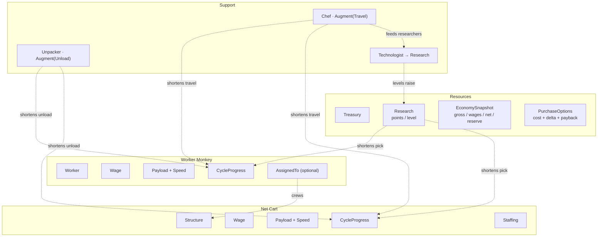

# Banana Incremental — Text-Only MVP Architecture (v2)

**Engine:** Bevy (Rust), ECS-first, headless/text renderer
**Scope:** Establish the simulation core. No visuals, no persistence, no prestige.

Supersedes v1. The economy is no longer a flat rate per unit; it is a harvest
cycle with separately attackable segments. Every change below is traceable to a
measured result in the companion white paper.

---

## 1. Core Loop

Monkeys walk to a grove, pick bananas, walk back, and unload them. That round
trip is the whole game.

Bananas pay wages and buy more monkeys. Some monkeys harvest. Others make the
harvesters better at exactly one part of the trip — Chefs feed them so they walk
faster, Unpackers clear the depot so they unload faster, Technologists research
better picking technique and unlock the Net Cart.

Because each support role shortens one segment of the cycle and no other, no
support role stays the best purchase for long. The player's job is to find the
current bottleneck and pay to remove it, then find the next one.

---

## 2. Invariants

| # | Invariant |
|---|---|
| ~~I1~~ | ~~Net banana rate is strictly positive after every legal purchase.~~ **Deleted, support increment.** |
| ~~I2~~ | ~~No harvester is *offered* unless its projected net delta is positive.~~ **Deleted, support increment.** |
| I3′ | Production **rate** is derived from world state every tick and never cached. Harvest **progress** is per-entity state, stored as remaining work. The treasury is credited on delivery. |
| I4 | The player can always see gross rate, wage rate, and net rate simultaneously. |
| I5′ | A purchase requires the *unencumbered* treasury to cover its cost: the balance less every meal a harvester has already reserved against a delivery it has made. There is no wage reserve. |

I3′ is the load-bearing one, and it is weaker than v1's I3 by necessity. A
monkey halfway to the grove is *somewhere*, and that position is not derivable
from component counts. What survives is the part that mattered: the rate is
still a pure function of counts and multipliers, so nothing can silently drift
out of sync with the world.

I5 was once a *wage reserve*, because cart income is lumpy while wages were
continuous. D18 removed the reserve for workers by removing the mismatch, and
D19 removes it for everyone by making every monkey post-paid. What is left of I5
is the encumbrance in D20: the price on the button is the price, but a banana a
monkey has already earned is not yours to spend.

**I1 and I2 are both gone.** I2 hid a unit whose price the player could
otherwise have been saving toward, which is a worse failure than showing a bad
buy — and with D11's payback numbers replaced by a live marginal rate (D21)
there is no ranked list left for it to protect. I1 died of ill-definition: once
an unfed monkey stops contributing to its multiplier (D19), `net` at the
whitepaper's end state is −1.44/s with everyone fed and +0.59/s with the
technologists idle, so the gate's answer depended on a multiplier state it never
named. Its stated purpose — "a purchase that drives net to zero strands the run"
— no longer holds either: an unaffordable monkey goes idle and stops eating, so
the economy recovers by itself.

---

## 3. Decision Log

**D1 — Bananas are a resource, not entities.**
`f64` in a `Treasury` resource. Counts stay far below $2^{53}$ in the MVP, but
the type should not need revisiting when prestige arrives.

**D2 — Wages are a per-unit component, not a global formula.**
Tiers tune independently without touching systems.

**D3 — Five unit types.**
Worker Monkey (harvests on foot), Net Cart (harvests with a crew of three),
Chef (speed), Unpacker (unload rate), Technologist (research).

**D4 — All multipliers are additive within their term.**
`M = 1 + count × bonus`. Multiplicative stacking is unbalanceable at this stage.
Revisit post-MVP.

**D5 — Augments target a cycle segment, not an entity.**
Support units declare which *term* of the harvest cycle they shorten. No entity
relationships, no dangling references, and a new vehicle tier inherits correct
support sensitivity without a design decision.

**D6 — *Deleted.***
v1 exempted carts from the chef bonus to manufacture a tradeoff. Measured, that
rule removes Chefs from the game entirely: zero purchased across a full run,
because carts absorb workers into crews and leave no pool for chefs to improve.
One speed multiplier now applies to every travel segment, carts included. The
tradeoff survives on its own — see §5.

**D7 — Worker assignment is modelled by presence of a component.**
An unassigned worker has no `AssignedTo`. The pool is the query
`With<Worker>, Without<AssignedTo>`.

**D8 — *Deleted* (support increment).**
Carts are now crewed by exactly three monkeys or they do not run: a cart may only
be bought when three spare workers exist, and if they do not, its price includes
buying them. Partial staffing, the sampled crew fraction, and `delivery_scale`
all go with it. What the rule bought — a retired vehicle not becoming a permanent
tax — is bought more simply by there being no such thing as a half-crewed cart.
The original text follows.

~~Structures may be under-staffed and produce proportionally, and their
wages scale the same way.~~
A 1-of-3 crewed cart produces at ⅓ *and costs ⅓ of its wage*. Production-only
scaling makes a retired vehicle a permanent tax, which matters more once
vehicles are a ladder. Every cart performs the nominal full-cart segment work;
its crew fraction is sampled when a cycle starts and scales only the delivered
payload. Assignment changes therefore affect its next cycle. This keeps every
segment duration unchanged and makes production exactly proportional.

**D9 — No intermediate aggregation resource.**
Multipliers are locals inside the production system. Reintroduce when a second
augment targets the same term and the map stops being trivial.

**D10 — `AssignedTo` is the only record of staffing.**
`Staffing` carries `required` only. Assigned counts are tallied by query.

**D11 — Offers project rates, and only for harvesters.**
Each harvester's offer carries cost, projected net delta, and payback seconds.
Technologists are excluded — see D14.

**D12 — Production is `payload / cycle_time`.**
```
T = travel/M_speed + pick/M_tech + unload/M_unpack
```
Three addends, three support roles, one each. This is the whole design.

**D13 — Cycle progress is stored as remaining work, not elapsed time.**
Metres left to walk, nominal bananas of work left to pick or unload, and the
cycle's delivery scale; each tick consumes remaining work at the current
multiplier's rate. The nominal work equals literal payload at full staffing. At
partial staffing D8 scales settlement, not segment work. Buying a Chef then
correctly speeds up the rest of every trip already in flight without teleporting
anyone down the road, and buying an Unpacker helps carts already queued at the
depot. It also collapses three segments into one uniform representation.
The UI labels gross and net as steady-state averages and shows each cart's
in-flight payload, so a staffing change cannot make the next delivery look
incorrect.

*Implementation note (Worker Monkey, 2026-08-18).* A tick must be spent as a
**time budget**, not as `remaining -= rate × dt` followed by `remaining <= 0`.
The naive form fails twice, and both failures are silent:

- `1/20` is not exactly representable in binary, so repeated subtraction leaves
  a *positive* residual — 9.4e-15 on a 5-banana pick segment, 1.0e-15 on
  unload. Each residual costs a whole extra tick, stretching the worker cycle
  past its nominal 50.0 seconds.
- Discarding the budget left over at a segment boundary loses `dt/2` per
  boundary, a 0.21% throughput error at these parameters. Because the loss is
  absolute, it grows as a *fraction* when multipliers shorten the cycle: 0.28%
  with ten Chefs, 0.43% at `M_speed = 2.5`. Buying support would quietly make
  the implementation less accurate.

So: consume `needed = remaining / rate` out of a per-tick budget, carry the
remainder across the boundary, and compare with a tolerance of a billionth of
the segment's duration. A bounded iteration guard is load-bearing rather than
defensive — a zero rate makes `needed` infinite and the loop never terminates.

**D14 — Technologists are never ranked against harvesters.**
Their banana delta is exactly $-\text{wage}$ at every possible world state — it
carries no information. Ranking them requires net-present-value reasoning over
an invented horizon. The research track gets its own readout in the full
product; in the MVP the Technologist simply appears in the shop with a research
figure and no payback number.

**D15 — *Deleted* (support increment).** See D19: nothing drains continuously
any more, so there is nothing left to reserve against. The original text follows,
because the *reasoning* about lumpy income is still the reason D20 exists.

~~Purchases are gated on a wage reserve.~~
```
reserve = 2 × max(0, wages − pool_income) × cart_cycle / cart_count
```
Only the wages that carts are covering are at risk, and only for one delivery
gap. Costs 0.3 minutes across a 24-minute session.

*Superseded for harvesters by D18 (2026-08-18); the amendment below still
governs every continuously-drained unit, which is today the support staff and
the cart crews.*

*Amended (Worker Monkey, 2026-08-18) — the formula returns zero for a cart-free
economy, and that is wrong.* It hard-codes "the lumpy source is carts, the
continuous one is the pool", so with `K = 0` it reserves nothing. But a lone
worker delivers once every 47.5 seconds, which is not continuous by any
reading, and the treasury goes underwater without a reserve.

The fix is to identify the lumpiest source by *measurement* rather than by
name: reserve against the largest gap between deliveries, and credit only the
income that keeps arriving inside it.

```
gap     = maxᵢ (Tᵢ / nᵢ)                 over every source in the field
covered = Σ { rateᵢ : Tᵢ / nᵢ < gap }
reserve = 2 × max(0, wages − covered) × gap
```

This reduces to the published cart form whenever carts are the lumpiest source,
and to a constant **2.85 bananas** for a worker-only economy — `2 × 0.03W ×
47.5/W`, independent of `W`. Measured over 30 purchases and 40 seeds: median
worst dip −3.36 → −1.09, minimum −6.54 → −3.04, for 1.8% of pacing. The first
hire therefore needs 6.85 bananas rather than 4. All 39 contract assertions
still pass.

One near miss is worth recording, because it looks correct and is not. Using a
*blended* mean gap, `1 / Σ(nᵢ/Tᵢ)`, also collapses to 2.85 for workers — but it
under-reserves badly once carts exist (38.5 against a measured −66.0 dip at
`K = 4`), because frequent five-banana pool deliveries drag the average gap down
without doing anything to cover wages across the two-hundred-banana cart gap.
Averaging delivery *frequency* is the wrong statistic when income is both lumpy
and heterogeneous.

The alternative considered and rejected was clamping the treasury at zero.
Unpayable wages then become *free bananas*: a 12.5% pacing gift concentrated in
the first twelve purchases, and an exploit with no on-screen tell, since
spending down to exactly zero buys a wage holiday until the next delivery. At
`W ≈ 7` the forgiven amount exceeds the price of the monkey that caused it. Debt
is allowed to happen instead; it is rare and small, exactly as §6 intends.

**D16 — *Mostly deleted* (support increment).** The jitter existed to protect the
D15 reserve, and D15 is gone; measured against remaining-work progress the −38 →
−255 dip is 0.000 either way. Boarding staggers carts naturally, since three
workers finish their trips at different times. What survives is the *save-restore*
phase for workers, which is presentation, and the deterministic index-derived
stagger on support shifts — which is `worker::Lane`'s trick, not randomness. The
original text follows.

~~Cart cycle phase is randomised after assignment on spawn.~~
Carts bought in one burst otherwise synchronise. Measured, that deepens the
treasury dip from −38 to −255 in the same economy. One line; prevents a
punishment the player cannot see or diagnose. A new cart remains pending until
assignment completes, then samples its crew fraction and initial phase together.

Workers remain phase zero when newly hired so the purchase has a clear visible
consequence. On save restore, however, the existing workforce is assigned a
random elapsed-time phase across the cycle. This avoids a resume screen full of
monkeys reset to the stall without changing the economy: phase construction is
pure presentation state, and return-leg phases already imply a carried banana.
The geometric cost ladder still staggers hires on its own.

Carts keep their jitter: their wages are still drained continuously, so D15
still binds and the −38 → −255 measurement still stands.

*One cost this decision did not anticipate.* Withdrawing jitter was argued
purely against the treasury dip, which post-paid meals had already flattened to
0.000. But D18 introduced a *second* phase-sensitive channel: a worker stalls
only if a purchase lands inside its 2.5-second snack window. With jitter that is
an independent 5% risk per worker; without it, workers hired close together
snack in lockstep, so one ill-timed purchase can stall a whole cohort at once. A
single delivery funds 3.3 meals, so a cohort unblocks within a cycle and the
severity is low — but jitter is no longer *purposeless* for workers, and if the
stall ever becomes a harsher mechanic this is the first decision to revisit.

*And one presentational cost that was live.* Identical phases mean identical
positions: workers sharing a depth lane drew exactly on top of each other, so
four hires showed three monkeys. Jitter used to hide it. `worker::Lane` now
carries the hire index and derives a small deterministic along-route offset from
it — a presentation fix, deliberately not an economic one.

**D18 — Harvesters are paid out of the delivery they have just made.**
*(Worker Monkey, 2026-08-18. Supersedes D15 for workers.)*

A worker's cycle gains a fourth addend: a **snack**, taken at the stall
immediately after unloading, costing a fixed share `f = 5%` of the trip.

```
T       = (travel/M_speed + pick/M_tech + unload/M_unpack) / (1 − f)
meal    = w_salary × T           = 1.5 bananas of the 5 just delivered
```

The reserve existed to hedge a timing mismatch — wages fall due continuously,
income arrives in lumps — and for workers the mismatch was total: a fresh hire
spent a whole cycle costing bananas before earning any. Removing the mismatch
beats reserving against it on every axis:

- **Solvency becomes structural.** The credit strictly precedes the debit within
  a cycle and strictly exceeds it, so the treasury cannot fall below where it
  stood before the delivery. Measured worst dip over 20 minutes: **0.000** at
  `W` = 1, 4, 10 and 25, against −1.42 drained. I5 therefore reduces to
  `bananas ≥ cost` for workers.
- **The price stops lying.** The shop quoted 4.0 and enforced 6.85. That is the
  single piece of player-reported confusion this change came from.
- **The counter reads as arithmetic**: +5, then −1.5 two seconds later, flat in
  between — instead of an imperceptible 47-second drain punctuated by a jump.
- **Nothing downstream moves.** Both the meal and the eating time are defined
  against the cycle, so `w_salary` stays exactly 0.03/s at every multiplier.

**The share is load-bearing; a fixed 2.5 s is not the same decision.** Fixed, the
snack becomes an ever-larger slice of a shortened cycle: chefs would raise the
cost of labour per second and partly cancel themselves, and worker throughput
would converge to `q / t_snack` rather than to the §3 pick-rate ceiling that
bounds the entire game. Held as a share it costs a flat 5% of that ceiling, and
the ceiling theorem survives as `(1 − f) × M_tech / t_pick`. The contract suite
caught this: `CEIL worker throughput converges` failed against a fixed snack.

**A meal is deferred, never forgiven.** A worker that cannot afford its meal
stalls at the stall and resumes when food arrives; the debt survives. Clamping
the treasury at zero instead would turn unpayable wages into free bananas — a
12.5% pacing gift and an exploit with no on-screen tell, since spending to
exactly zero would buy a wage holiday. Stalling is a penalty, and it is the only
place in the economy where overspending has a visible consequence: the sprite
greys out and production stops.

Implementation-wise the settlement loop threads a **larder** — the treasury at
the top of the tick, plus everything delivered so far during it — through every
worker in turn. A worker eats only what the larder holds. That single value is
what makes the treasury non-negative by construction rather than by gate.

**Owed by the cart increment.** Cart crews still drain continuously, so D15 and
D16 still bind for them, and until they adopt a snack workers converge 5% under
the §3 ceiling while carts converge on it. That asymmetry is this decision's one
outstanding cost.

**D17 — *Deleted* (support increment).**
Auto-pull existed to answer "which monkeys crew the cart?" every tick. With crew
fixed at three and bought with the cart, the question is asked once, at purchase,
and answered by boarding: the cart spawns as an empty box at the deposit and
takes the next worker to finish its snack, first come, until it is full. The
original text follows.

~~Assignment is auto-pull.~~
Cart slots beat the pool by 230–280% at every reachable world state, so the
optimal policy is always "fill every slot, overflow to the pool." Manual
assignment can only reproduce that with extra clicks or produce a worse result.
D7 and D10's representation stays; the player-facing choice is removed.

**D19 — Every monkey is post-paid, and an unpaid one goes idle.**
*(Support increment.)*

D18 gave harvesters a snack taken out of their own delivery. Support staff have
no delivery, so they get the same deal against a bare **10-second shift**:
`meal = wage × 10`, which is 1.0 for a Chef or Unpacker and 2.0 for a
Technologist. A bare period rather than anything derived from the harvest cycle,
because `meal / period` is then `wage` exactly with no multiplier in either
factor — the property D18 needed a *fraction* to obtain for workers comes free
here, since a shortened harvest cycle does not shorten a chef's shift.

Ten seconds rather than a worker-length fifty. Nothing funds this meal at the
moment it falls due, so the period sets the size of the lump landing on the
larder; at 10 s a chef recovers from an empty larder in under two seconds at a
modest pool, where 50 s would make the meal five times bigger and the recovery
five times longer. Starvation *frequency* is set by how hard the player is
spending. The period only sets how much it hurts.

**An unfed monkey drops out of its multiplier sum**, greys, and retries every
tick — `M = 1 + Σ *fed* units × bonus`. This is the same stall D18 gave a hungry
worker, moved to the units that can actually reach it. It does not run away:
a worker's meal can never exceed 1.5 of a 5-banana payload, so every pool worker
contributes at least 0.07/s at the worst possible multiplier state while support
drain falls to zero. Swept across ~300k reachable states, there is no
configuration where net is positive with everyone fed and negative with one chef
idle, so there is no bistable trap. What does happen is a partial equilibrium —
at over-supported states the Technologist is idle 40–72% of the time, the rate
stays positive, and the run stays alive.

**Feeding order is Unpacker → Chef → Technologist**, and deliberately not
declaration order. Under scarcity a fixed type order spends the last banana on
the least valuable monkey: an Unpacker's marginal contribution is 3.6× a Chef's
at the end state and 5.9× at twelve minutes, because by then the cart's unload
segment dominates. Research is worth nothing to anything currently in flight, so
it eats last. Fixed rather than recomputed from marginal value, because a fixed
order is deterministic and cheap and starvation is meant to be the rare edge of
the economy rather than a state worth optimising inside.

**D20 — A harvester's meal is reserved out of the delivery that funds it.**
*(Support increment.)*

D18's solvency argument was "the credit strictly precedes the debit within a
cycle and strictly exceeds it". That holds only if nothing else can spend the
credit in between — and D19's support staff, who draw on the same larder and
deliver nothing into it, can. The gap is small (2.5 s of a worker's 50 s trip)
and it is real: measured, workers stalled **8.4%** of the time after a
spend-to-zero shock at the whitepaper's end-state support bill.

So `HarvestCycle` carries an `earmarked` field. At Unload the whole payload is
delivered and credited — the counter still reads the arithmetic D18 wanted, +5
then −1.5 — but only `payload − meal` enters the larder. The snack is then eaten
out of the reservation and never touches the shared pool.

Two claimants have to respect it for this to mean anything. Support staff do,
through the larder. **The shop does too**, through `spendable = treasury −
committed`: the quoted *price* does not move, since quoting a higher price is
exactly the lie D18 was written to remove, but an encumbered balance cannot
cover it.

This is what makes the cart possible at all. A cart's meal is **37.9 bananas**
against a 200-banana payload, and a cart that missed one would freeze holding
that payload. At an empty pool — legal, since D8's deletion lets you spend your
last three spare workers on the crew — the cart is the only harvester, so income
would be identically zero and the treasury could never climb back to free it. An
absorbing soft-lock whose only exit is 37 manual clicks with nothing on screen to
explain it.

*One designed mechanic dies here, and it is worth being explicit about it.*
A worker can no longer go hungry: its food is reserved from its own delivery, and
neither the player's spending nor the wage bill can reach it. D18 called stalling
"the only place in the economy where overspending has a visible consequence".
That consequence now lands on the support staff instead — which is a better
teaching signal, because it points at the actual mistake: you hired staff you
cannot feed. The grey pulse, the HUNGRY readout and the idle sprite all moved
from `worker` to `support` rather than being deleted.

**D21 — The shop shows a live marginal rate, not a static effect.**
*(Support increment.)*

D11 projected rates for harvesters only, on the grounds that a support unit's own
banana delta is exactly `−wage` and carries no information. True, and beside the
point: what a Chef is worth is not what it produces but what it makes everybody
*else* produce. The shop's GAIN column is that number, recomputed every tick.

The alternative was a static effect string — "TRAVEL +15%" — which is honest
about the mechanism and useless for the comparison the table exists to support:
three different units down one column, and a figure that means +12.6% throughput
in a worker-heavy world and about +1% in a cart-heavy one. That is precisely the
Amdahl rotation §5 calls the whole design, hidden behind a constant. A live rate
shows a Chef at +4.2/min early and falling below its own wage once carts drain
the pool, which is the bottleneck moving, rendered.

The Technologist keeps `+1.0 RESEARCH/s` and a different colour. Being visibly
the one row the ranking does not price is correct (D14); it should look
intentional.

---

## 4. Data Model

### Resources

```rust
#[derive(Resource)] struct Treasury { bananas: f64 }
#[derive(Resource)] struct Research { points: f64, level: u32 }

#[derive(Resource, Default)]
struct EconomySnapshot {
    gross_per_sec:  f64,   // steady-state expected rate: Σ payload / cycle_time
    wages_per_sec:  f64,
    net_per_sec:    f64,
    wage_reserve:   f64,
}

#[derive(Resource)] struct UnitCosts { /* base + growth per type */ }

#[derive(Resource, Default)]
struct PurchaseOptions { offers: Vec<Offer> }

struct Offer {
    kind: UnitKind,
    cost: f64,
    projected_net_delta: f64,
    payback_secs: f64,
    affordable: bool,          // treasury ≥ cost + reserve  AND  net stays > 0
    cycle_effect: CycleDelta,  // powers the shop info panel
}
```

### Components

```rust
#[derive(Component)] struct Worker;
#[derive(Component)] struct Chef;
#[derive(Component)] struct Unpacker;
#[derive(Component)] struct Technologist;
#[derive(Component)] struct Structure;

#[derive(Component)] struct Wage(f64);
#[derive(Component)] struct Payload(f64);
#[derive(Component)] struct Speed(f64);

#[derive(Component)]
struct Augment { target: Segment, bonus: f64 }   // Travel | Pick | Unload

#[derive(Component)] struct Staffing { required: u32 }
#[derive(Component)] struct AssignedTo(Entity);

#[derive(Component)]
struct CycleProgress {
    segment: Segment,
    remaining: f64,
    delivery_scale: f64, // 1.0 for workers; cart crew fraction sampled at cycle start
}
```

`Wage` is shared across all five archetypes. `Payload` and `Speed` sit on
harvesters only. `CycleProgress` is the sole piece of irreducible per-entity
state in the simulation. Settlement credits `Payload × delivery_scale`.

---

## 5. Where the tradeoff lives

v1 tried to make carts interesting with a rule. The cycle model makes them
interesting with arithmetic.

| Cycle | travel | pick / load | unload |
|---|---|---|---|
| Worker on foot | **84%** | 11% | 5% |
| Net Cart, crew of 3 | 7% | 37% | **56%** |

A monkey on foot spends most of its life walking. A cart barely travels at all
and instead sits at the depot being emptied. So ten Chefs raise worker
throughput by 102% and cart throughput by 5%; ten Unpackers do the reverse, 4%
and 59%.

Nobody decided that. It follows from payload and speed, and it will keep
following from them when a tier-2 vehicle with a longer route turns out to be
more chef-sensitive than the cart was.

The decision is not "cart or pool?" — D17 settles that. It is *which segment of
which cycle am I paying to shorten?*, and the answer changes as you buy. In a
measured session the dominant cart segment moves from unload to load partway
through, at which point Unpackers quietly stop being the obvious buy.

---

## 6. Component Diagram



Every augment arrow terminates on a cycle segment. Chefs reach both harvesters
because both of them walk — that is D6's deletion, drawn.

---

## 7. System Schedule

```mermaid
graph LR
    P[1. Purchase<br/>drain treasury<br/>spawn pending] --> A[2. Assign<br/>fill cart slots<br/>overflow to pool]
    A --> I[3. Initialize<br/>sample crew fraction<br/>jitter new cart phase]
    I --> M[4. Multipliers<br/>speed / unpack / tech<br/>as locals]
    M --> AD[5. Advance Cycles<br/>consume remaining work<br/>emit Delivered events]
    AD --> SE[6. Settle<br/>treasury += deliveries<br/>treasury -= wages × dt]
    SE --> SN[7. Snapshot<br/>steady-state rate<br/>wages, net, reserve]
    SN --> OF[8. Project Offers<br/>delta + payback<br/>+ cycle effect]
    OF --> RE[9. Render<br/>snapshot + offers<br/>in-flight payload]
```



Stages 4, 7 and 8 are pure functions of world state. Stages 3 and 5 are the only
writers of `CycleProgress`; stage 6 is the only writer of `Treasury`. Stage 5
samples current staffing only when beginning the next cycle.

### Tick Math

```
M_speed   = 1 + chefs      × chef_bonus
M_unpack  = 1 + unpackers  × unpack_bonus
M_tech    = 1 + tech_level × tech_bonus

T_worker  = 2d/(v_w·M_speed) + q·t_pick/M_tech       + q·t_unload/M_unpack
T_cart    = 2d/(v_k·M_speed) + Q·t_pick/(r·M_tech)   + Q·t_unload/M_unpack

gross     = pool × q/T_worker + carts × Q/T_cart × staffed/r
wages     = Σ Wage, cart wages scaled by staffed/r
net       = gross − wages
reserve   = 2 × max(0, wages − pool_income) × T_cart / carts
```

Offer projection reuses the same expression with one unit hypothetically added,
and reports the diff of every segment it changed — which is exactly what the
shop's info panel renders.

---

## 8. MVP Feature Cut

**In:** five unit types; harvest cycles with per-entity progress; escalating
per-type costs; research levels gating the Net Cart; auto-pull crewing;
live gross/wages/net/reserve readout; per-offer payback and cycle-effect diff;
fixed-step tick loop with decoupled text refresh.

**Out:** save/load, prestige, offline progress, population cap, additional
vehicle tiers, retiring or reassigning technologists, a persistent research
progress bar, achievements, any rendering beyond stdout.

The research progress bar is deliberately deferred rather than cut — see §10.

---

## 9. Resolved Questions

1. **Cost growth curve** — per type. Worker 1.15, Chef 1.30, Unpacker 1.30,
   Technologist 1.35, Cart 1.70. These are the primary balance levers.
2. **Manual vs auto-pull assignment** — auto-pull (D17). Manual assignment also
   breaks offer projection: an unstaffed cart produces nothing, so its delta is
   $-\text{wage}$ and I2 would never offer a cart at all.
3. **Cart purchasable with an empty pool** — no, and it needs no special case.
   Projected delta is negative and I2 suppresses it.
4. **Fixed timestep** — sim at 20 Hz, text at 4 Hz. Every contract test depends
   on determinism.

## 10. Known Gaps

**The Technologist has no pull.** D14 removes it from the ranked list, and the
MVP has no research progress bar. A player following payback order will never
buy one, never unlock the Net Cart, and never see the second half of the game.
In a text MVP where all five units are visible at once this is survivable; in
the full product the research bar with its named next unlock is what closes it.
Flagged here so it is not rediscovered as a bug.

**Retired Technologists are permanent overhead.** With capped research they end
the session drawing wages for nothing — six of them, 1.2 bananas/sec against a
15-banana gross. Tolerable now; under a population cap they are six monkeys not
harvesting, which is a different problem. Retraining is the v2 fix.
